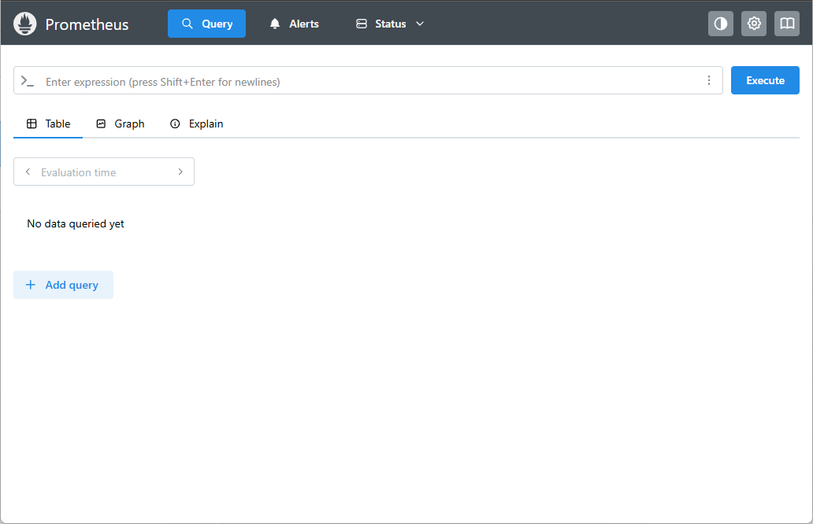

## Introduction

In this module, we explore what Prometheus is and the problems it was designed to solve.  
We examine the different types of monitoring and how they compare, setting the foundation for understanding modern observability practices.  

You will learn about the history of Prometheus, including its origins at SoundCloud and the motivations behind its architecture and design. We then dive into Prometheus’ core components, how it fits into the observability ecosystem, and how it integrates with other systems.  

Finally, we install Prometheus, explore its default configuration, access the web interface, and run our first PromQL query — marking the beginning of our hands-on monitoring journey.

&nbsp;
## Why Do We Need Tools Like Prometheus?

Before diving into what monitoring actually is, it’s important to understand the broader context. This helps clarify why Prometheus exists and why monitoring systems are critical for modern environments.

Every company has an infrastructure where one or more applications are running and consuming compute resources — whether on-premises, in a datacenter, or more commonly today, in a cloud provider.

Consider a simple example: an online store (an e-commerce platform). Think about how many components must be monitored to ensure everything is working as expected.

For instance, this store likely uses a web server such as Nginx. But Nginx itself must run somewhere — a VM, a container, a Pod, or a cloud instance. If we choose to run Nginx inside a VM, the list of things we need to monitor grows quickly:  
- the VM itself  
- the hypervisor managing the VM  
- the physical host running the hypervisor  
- the Linux OS inside the VM  
- all network components handling customer traffic  

And this is still a very simple scenario. Real environments involve high availability, resilience, compliance requirements, and strict operational constraints.

Even just the host running the VM includes enough metrics to keep you busy for days. There is no shortage of components that require monitoring in a real-world environment.

Monitoring, however, is not only important when something breaks. It helps track patterns, understand how systems behave, and observe ongoing activities. For example, while writing these notes, I am tracking the flight of family members returning to Brazil — all thanks to some monitoring system providing real-time information.

For technology professionals, understanding how to implement and maintain a reliable monitoring solution is essential. Monitoring provides the data needed to ensure reliability, efficiency, and visibility — all of which directly impact business value.

A good monitoring system lets us determine whether a service is fully operational or degraded and potentially delivering a poor experience to users.

### What Does It Mean to Monitor?

Monitoring, in essence, means knowing the current status of the component you care about.  
For example, when dealing with a physical Linux machine, you may want to monitor the hardware to ensure that CPU overheating does not affect system availability. Similarly, you need to monitor the operating system to avoid issues such as a full disk or an overloaded network interface impacting performance.

And that’s without even touching the guest OS inside the VM or the application itself — such as Nginx.

Monitoring means knowing what is happening in your infrastructure, applications, and services **in real time**, and ensuring that the appropriate teams are notified when a failure or anomaly occurs. Alerts should contain enough information to support efficient troubleshooting and recovery.

&nbsp;
#### Monitoring vs Observability

Now that you have a sense of what monitoring means, we can go a bit deeper and introduce the broader concept of **observability** — which enhances our ability to understand and analyze system behavior.

Using the same example of Nginx running on a Linux VM:  
Previously we talked about **events** related to hardware failures and **metrics** such as network bandwidth usage. But imagine going further and being able to **measure the latency of each request** processed by your web server.

Imagine also capturing and storing **logs** for every request that returns an error or contains performance-related information.

Or even better, imagine tracing the entire **lifecycle of a user request** — from the moment it enters the first component of your infrastructure to the final millisecond of its execution — while also collecting internal **metrics** that describe how each service behaved along the way.

And finally, imagine consolidating all this data and correlating it visually through comprehensive **dashboards**, filled with graphs and tables that help you understand system behavior during failures or performance degradation.

If you can imagine all that, then you’ve pictured observability at its best.

Observability is commonly described as consisting of three pillars:

- Logs  
- Metrics  
- Traces  

I personally add a fourth pillar: **Events**.  
Being able to correlate events with logs, metrics, and traces provides invaluable insights during incidents or unexpected behavior. So let’s update the list:

- Logs  
- Metrics  
- Traces  
- Events  

And to be completely honest, I would still add **Dashboards** as a fundamental element — because visualizing these pillars together is essential for fully understanding how systems behave, especially during failures.

If your environment provides visibility across these four pillars, congratulations — you have a solid observability foundation!  

In the examples we discussed earlier, you can see that all four pillars are represented. Go back and check — I bet you noticed it too.

At this point, you might be asking yourself:

**“So… what does Prometheus have to do with all of this?”**

That’s exactly what we’ll cover next.

&nbsp;
### What Is Prometheus?

Prometheus is one of the most modern and widely adopted monitoring systems, designed to collect and store metrics from a wide variety of infrastructure components. Development began in 2012 and the project was officially announced by SoundCloud in 2015.  
Its design was strongly inspired by **Borgmon**, Google’s internal monitoring system responsible for observing **Borg**, Google’s container management platform — which is also known as the predecessor of Kubernetes.

Prometheus is not only a powerful metrics collection engine; it also includes its own **TSDB (Time Series Database)**.  
I’m not translating “time series database” because “banco de dados temporais” sounds a bit odd in Portuguese — even though it’s technically correct.

A TSDB is a database optimized for storing and querying data points associated with timestamps. It is purpose-built to handle large volumes of time-based information extremely efficiently. This makes it ideal for metrics, where the timestamp is just as important as the value itself — whether you’re retrieving a specific minute of data or ingesting millions of points per hour.

Prometheus also supports highly expressive and powerful queries through **PromQL**, enabling deep correlations between metrics and visualization through dashboards.  
We will explore all of this throughout the training.

When looking at the pillars of observability, Prometheus fits squarely into the **Metrics** pillar, as its primary role is to collect, store, and expose metrics from different components of your infrastructure.

And since we’re talking about observability, here are some common tools aligned with each pillar:

- **Logs** → Graylog, Datadog  
- **Metrics** → Prometheus  
- **Traces** → Jaeger, eBPF  
- **Events** → Zabbix, Datadog  
- **Dashboards / Visualization** → Grafana, Datadog, Pixie  

Now that we understand monitoring, observability, and what Prometheus actually is, we’re ready to start diving deeper into this amazing tool.

&nbsp;
### Prometheus Architecture

I get a diagram of the Prometheus architecture to help us better understand how it works.


Prometheus is built around three **core** components:

- **Retrieval**
- **Storage**
- **PromQL**

**Retrieval** is responsible for collecting metrics and interacting with **Storage** to store them. It also communicates with **Service Discovery** to find available targets from which metrics can be pulled.

**Storage** handles the persistence of metrics in the TSDB (time series database), which is essential for efficient ingestion and querying. Prometheus stores data on the local disk of the node where it runs. So, if Prometheus is running on a VM, the data will be stored on that VM’s disk.

**PromQL** executes user queries and interacts with **Storage** to retrieve the requested metrics. PromQL is a powerful query language, very different from SQL, and specifically designed for time series data.

Throughout the training, we will explore several examples of PromQL queries and understand how it helps us extract meaningful metrics.

Here’s a small example of a PromQL query:

```promql
query = 'avg(rate(container_cpu_usage_seconds_total{container_name!="meu-nginx",image!="nginx"}[5m]))'
```

This query returns the average CPU usage rate of all containers that do not have the name "meu-nginx" and are not using the "nginx" image.

A key strength of the Prometheus ecosystem is how easily it integrates with tools such as Grafana, Alertmanager, Zabbix, and many others.

&nbsp;
### Installing Prometheus

Now that we understand monitoring, observability, and what Prometheus is, it's time to finally start working with the star of this training: **Prometheus**!

There are many ways to install Prometheus. You can run it on a Linux VM, an instance in any cloud provider, or even on a physical on-premises server.  
It can also run in containers on your local machine using Docker or any other container runtime. And if the goal is to use Prometheus in a production environment, then a container orchestrator such as **Kubernetes** or **Nomad** becomes essential.

We’ll start by installing Prometheus on a Linux machine. This Linux machine could be a VM, a cloud instance, or a bare-metal server—it doesn’t matter.

This will be our first Prometheus installation, so don’t worry: throughout the training we’ll explore other installation methods to ensure you feel completely confident using Prometheus in real environments. Remember, the goal here is to keep the training as close as possible to what you would find in an actual production environment.

&nbsp;
#### Installing Prometheus on Linux

It's important to be familiar with the official Prometheus website, as this is where you'll learn all the details directly from the documentation and follow updates and new features of the project.

Prometheus website: https://prometheus.io/  
Download page: https://prometheus.io/download/

To run Prometheus on Linux in a way that works across most distributions, we’ll follow these steps:

First, download the Prometheus binary package. There are prebuilt binaries available for Linux, Windows, and macOS.

Inside the `.tar.gz` package you’ll find two binaries: **Prometheus** and **Promtool**.

- **Promtool** is a very handy utility that allows you to execute queries directly from the command line.  
- The **Prometheus** binary is the actual *Prometheus Server*, responsible for making everything work.

You’ll also find the **consoles**, **console_libraries** directories, and the default configuration file **prometheus.yml**, which we’ll use in this first example.

Now that we understand what each piece is, let’s begin.

&nbsp;
Downloading Prometheus:

```bash
curl -LO https://github.com/prometheus/prometheus/releases/download/v3.8.0/prometheus-3.8.0.linux-amd64.tar.gz
```

&nbsp;
Extract the archive:

```bash
tar -xvf prometheus-3.8.0.linux-amd64.tar.gz
```

&nbsp;
Move binaries to /usr/local/bin

```bash
sudo mv prometheus-3.8.0.linux-amd64/prometheus /usr/local/bin/prometheus
sudo mv prometheus-3.8.0.linux-amd64/promtool /usr/local/bin/promtool
```

&nbsp;
Test the installation:

```bash
prometheus --version

prometheus, version 3.8.0 (branch: HEAD, revision: e44ed351cdf0181f9fde56ba096f4d949f9e295d)
  build user:       root@e0c39c41863e
  build date:       20251202-09:08:25
  go version:       go1.25.4
  platform:         linux/amd64
  tags:             netgo,builtinassets
```

&nbsp;
Create configuration directories:

```bash
sudo mkdir /etc/prometheus
```

&nbsp;
Move configuration file:

```bash
sudo mv prometheus-3.8.0.linux-amd64/prometheus.yml /etc/prometheus/prometheus.yml
```

&nbsp;
Edit the main configuration file:

```bash
sudo vim /etc/prometheus/prometheus.yml
```

&nbsp;
Recommended configuration:

```yaml
global:
  scrape_interval: 15s
  evaluation_interval: 15s
  scrape_timeout: 10s

rule_files:

scrape_configs:
  - job_name: "prometheus"
    static_configs:
      - targets: ["localhost:9090"]
```

&nbsp;
Create Prometheus data directory:

```bash
sudo mkdir /var/lib/prometheus
```

&nbsp;
Create user and group:

```bash
sudo addgroup --system prometheus
sudo adduser --shell /sbin/nologin --system --group prometheus
```

&nbsp;
Create the SystemD service unit:

```bash
sudo vim /etc/systemd/system/prometheus.service
```

Service file:

```yaml
[Unit]
Description=Prometheus
Documentation=https://prometheus.io/docs/introduction/overview/
Wants=network-online.target
After=network-online.target

[Service]
Type=simple
User=prometheus
Group=prometheus
ExecReload=/bin/kill -HUP $MAINPID
ExecStart=/usr/local/bin/prometheus \
  --config.file=/etc/prometheus/prometheus.yml \
  --storage.tsdb.path=/var/lib/prometheus \
  --web.console.templates=/etc/prometheus/consoles \
  --web.console.libraries=/etc/prometheus/console_libraries \
  --web.listen-address=0.0.0.0:9090 \
  --web.external-url=

SyslogIdentifier=prometheus
Restart=always

[Install]
WantedBy=multi-user.target
```

&nbsp;
Fix permissions:

```bash
sudo chown -R prometheus:prometheus /var/log/prometheus
sudo chown -R prometheus:prometheus /etc/prometheus
sudo chown -R prometheus:prometheus /var/lib/prometheus
sudo chown -R prometheus:prometheus /usr/local/bin/prometheus
sudo chown -R prometheus:prometheus /usr/local/bin/promtool
```

&nbsp;
Let's reload **systemd** so the Prometheus service can be initialized:

```bash
sudo systemctl daemon-reload
```

&nbsp;
Now start the Prometheus service:

```bash
sudo systemctl start prometheus
```

&nbsp;
Enable the service to start automatically on system boot:

```bash
sudo systemctl enable prometheus
```

&nbsp;
Check the status of the Prometheus service:

```bash
sudo systemctl status prometheus
```

&nbsp;
You can inspect the logs to ensure everything is running smoothly:

```bash
sudo journalctl -u prometheus
```

&nbsp;
If you see the following message in the logs, it means Prometheus is up and running:

```bash
level=info msg="Server is ready to receive web requests."
```

&nbsp;
To finish, open the Prometheus web interface in your browser:

```bash
http://localhost:9090
```

&nbsp;
You should see a beautiful interface like the one below:



&nbsp;
## End of Module 1:

In Module 1, you learned what monitoring is, how it relates to observability, and what the pillars of observability are.
You also learned what Prometheus is and how it works.

We installed Prometheus, configured its initial setup, created the service unit, prepared the directory structure, configured the user and group, and accessed the Prometheus web interface to run your first query.

We checked the service status, validated the logs, understood the Prometheus architecture, and enjoyed the diagram I created.

Now it's time to rest and later review everything covered in Module 1.
