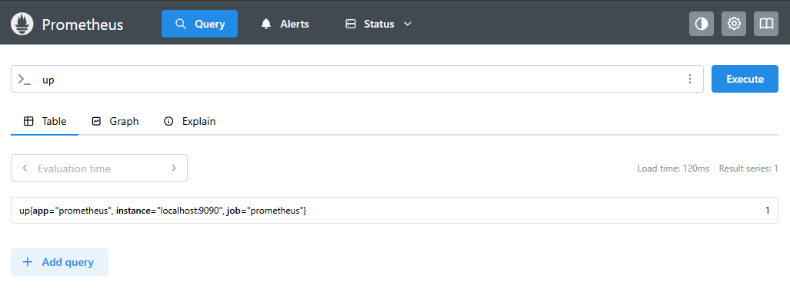

## Module 2: PromQL and Data Model

Welcome to **Module 2** of your training!  
Yes — I consider this a full training experience, not just a guide to getting the best out of the amazing Prometheus ecosystem.

Today, we are going to learn how to write our **first PromQL queries**, and to do that, we must understand the **Prometheus data model** in detail.  
We will explore what a metric truly is in Prometheus, how it is structured, and how it behaves. You will also learn how to create your **own custom metric** and build your first real queries.

We will build our **first exporter** using Python and Docker, and we’ll dive into the different **metric types** Prometheus supports — how they work, when to use each of them, and why they matter.

Finally, we will explore our first **PromQL functions**, giving you even more power to write effective and meaningful queries as your training continues.

&nbsp;
## Prometheus Data Model

The Prometheus data model is very straightforward, so let’s start by taking a real metric and querying its current value. This will help you clearly understand how the data model works in practice.

&nbsp;
### Querying a Metric

Let’s run a query to check the current value of the `up` metric for the server where Prometheus is running.

Simply enter the metric name:

```
up
```

Remember: we run the query through the Prometheus web UI on port **9090**, which is the default Prometheus port.

Open your browser and visit:

```
http://localhost:9090/
```



Query result:

```
up{app="prometheus", instance="localhost:9090", job="prometheus"}
```

This single line follows a very specific Prometheus pattern. Once you understand it, everything becomes much easier.

&nbsp;
### Querying via Terminal

If you'd like to get the same result from the terminal instead of the browser, run:

```
curl -GET http://localhost:9090/api/v1/query --data-urlencode "query=up"
```

Just to clarify what the `curl` command above does, let’s break it down step by step:

- `curl` is a tool that allows you to make HTTP requests. In this case, we are asking it to perform a GET request to `http://localhost:9090/api/v1/query` and send a query to Prometheus.

- The request is sent to the Prometheus API endpoint `http://localhost:9090/api/v1/query`, which is the default query URL used by Prometheus.

- The `curl` command includes the query we want to execute — in this example, the `up` metric — by passing the parameter `query=up`.

- We use the `--data-urlencode` flag, which allows `curl` to send data using URL encoding. This works similarly to the `--data` flag, but ensures that the data is properly encoded before being sent.

&nbsp;

The output looks like this:

```json
{
  "status": "success",
  "data": {
    "resultType": "vector",
    "result": [
      {
        "metric": {
            "__name__": "up",
            "instance": "localhost:9090",
            "job": "prometheus"
            },
        "value": [
            1661595487.119,
            "1"
            ]
        }
        ]
    }
}
```

