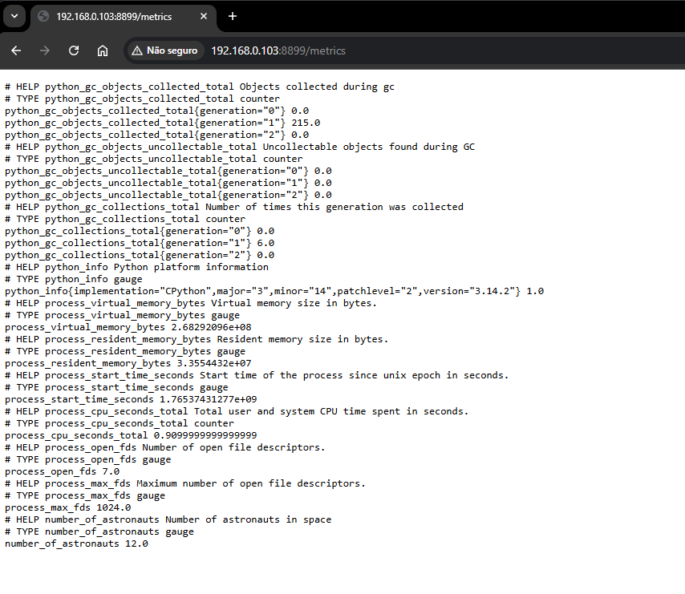

## Module 2: PromQL and Data Model

Welcome to **Module 2** of your training!  
Yes — I consider this a full training experience, not just a guide to getting the best out of the amazing Prometheus ecosystem.

Today, we are going to learn how to write our **first PromQL queries**, and to do that, we must understand the **Prometheus data model** in detail.  
We will explore what a metric truly is in Prometheus, how it is structured, and how it behaves. You will also learn how to create your **own custom metric** and build your first real queries.

We will build our **first exporter** using Python and Docker, and we’ll dive into the different **metric types** Prometheus supports — how they work, when to use each of them, and why they matter.

Finally, we will explore our first **PromQL functions**, giving you even more power to write effective and meaningful queries as your training continues.

&nbsp;
## Prometheus Data Model

The Prometheus data model is very straightforward, so let’s start by taking a real metric and querying its current value. This will help you clearly understand how the data model works in practice.

&nbsp;
### Querying a Metric

Let’s run a query to check the current value of the `up` metric for the server where Prometheus is running.

Simply enter the metric name:

```
up
```

Remember: we run the query through the Prometheus web UI on port **9090**, which is the default Prometheus port.

Open your browser and visit:

```
http://localhost:9090/
```


Query result:

```
up{app="prometheus", instance="localhost:9090", job="prometheus"}
```

This single line follows a very specific Prometheus pattern. Once you understand it, everything becomes much easier.

&nbsp;
### Querying via Terminal

If you'd like to get the same result from the terminal instead of the browser, run:

```
curl -GET http://localhost:9090/api/v1/query --data-urlencode "query=up"
```

Just to clarify what the `curl` command above does, let’s break it down step by step:

- `curl` is a tool that allows you to make HTTP requests. In this case, we are asking it to perform a GET request to `http://localhost:9090/api/v1/query` and send a query to Prometheus.

- The request is sent to the Prometheus API endpoint `http://localhost:9090/api/v1/query`, which is the default query URL used by Prometheus.

- The `curl` command includes the query we want to execute — in this example, the `up` metric — by passing the parameter `query=up`.

- We use the `--data-urlencode` flag, which allows `curl` to send data using URL encoding. This works similarly to the `--data` flag, but ensures that the data is properly encoded before being sent.

&nbsp;

The output looks like this:

```json
{
  "status": "success",
  "data": {
    "resultType": "vector",
    "result": [
      {
        "metric": {
            "__name__": "up",
            "instance": "localhost:9090",
            "job": "prometheus"
            },
        "value": [
            1661595487.119,
            "1"
            ]
        }
        ]
    }
}
```

Now let’s understand what is actually happening.

&nbsp;
### What did Prometheus return?

Let’s break down the result into parts so everything becomes clearer.

Prometheus always returns data following a consistent structure, and once you understand this pattern, reading any metric becomes much easier.

The result is divided into **two main components**:

---

### **1. The *identifier***  
This includes the **metric name** you queried and all associated **labels**.  
Labels provide context and allow you to filter metrics more precisely. For example, you can query the same metric with different label values, such as `instance="localhost:9090"`, `instance="webserver-01"`, or `instance="webserver-02"`.

---

### **2. The *value***  
This is the current value of the metric — the latest data point collected by Prometheus.

---

To make this easier to visualize, imagine the metric divided into these sections:  
- the metric name  
- its labels  
- the actual metric value  

This structure is the foundation of the Prometheus data model.


If you zoom in on the diagram, you’ll notice that the result is subdivided into even more pieces. Besides the metric name, we also have the labels with their respective values, and finally the current value of the metric.

Take a look at this other diagram:


What we can understand by looking at this query result is that our server is running — meaning Prometheus is working correctly. Notice that the result only shows the value **`1`**; it doesn’t tell us how long it has been running. It only reflects the *current* state. A value of **`1`** means the server is up, and a value of **`0`** would mean the server is down.

If we want to check the value of the `up` metric for the Prometheus server over the *last hour*, we need to express that in our query, which becomes:

```promql
up{instance="localhost:9090", job="prometheus"}[1h]
```

In this case, we are specifying that we want the values of the `up` metric from the `localhost:9090` server, under the `prometheus` job, for the **last hour** — we’re being very specific. :)

To request metrics from the last hour, we use the `[1h]` parameter at the end of the query.  
You can use:

- `h` for hours  
- `d` for days  
- `w` for weeks  
- `m` for months  
- `y` for years


The result was huge, right?  
And you're wondering why?

Remember that we configured Prometheus to perform a *scrape* every **15 seconds**.  
So, when you request the last **1 hour** of data, Prometheus returns **many points**, one for each scrape.

Here’s just the first result so you can understand it better:

```
up{instance="localhost:9090", job="prometheus"} 1 @1661595094.114
```

Notice that now we have `@1661595094.114`, which is the **timestamp** of the scrape — the exact moment when that metric value was collected.

Now that we understand the data model returned by Prometheus, we can move forward and start exploring and simplifying queries using the powerful Prometheus query language: **PromQL**!

&nbsp;
### Prometheus Queries and PromQL

As mentioned back in Module 1, **PromQL** is Prometheus’s query language, designed to let you build powerful, efficient, and expressive queries — and today we’re going to simplify it.

You’ve already seen a bit of PromQL in the previous examples, but now we’re going deeper so everything becomes clearer and you fully understand how PromQL works.

Before anything else, let’s add more metrics to our server so we can have more fun with real data.

But first, we need to create a new **exporter**.  
An exporter is a program that runs on the target host and exposes metrics so Prometheus can scrape them.

And yes — PromQL simply means **Prometheus Query Language**.

Let’s understand it better, but before that, let’s build our first Prometheus exporter.

```python
import requests  # Imports the requests module to make HTTP requests
import json  # Imports the json module to convert results to JSON
import time  # Imports the time module to use sleep
from prometheus_client import start_http_server, Gauge  # Imports Gauge and start_http_server from Prometheus

url_number_people = 'http://api.open-notify.org/astros.json'  # URL to get the number of astronauts

def get_number_astronauts():  # Function to get the number of astronauts
    try:
        """
        Get the number of astronauts currently in space
        """
        response = requests.get(url_number_people)  # Makes the HTTP request
        data = response.json()  # Converts the result to JSON
        return data['number']  # Returns the number of astronauts
    except Exception as e:
        print("Could not access the URL!")  # Prints error message
        raise e  # Raises exception

def update_metrics():  # Function to update metrics
    try:
        """
        Updates metrics with the number of astronauts and ISS location
        """
        number_people = Gauge('number_of_astronauts', 'Number of astronauts in space')  # Creates the metric
        
        while True:
            number_people.set(get_number_astronauts())  # Updates the metric
            time.sleep(60)
            print("The current number of astronauts in space is: %s" % get_number_astronauts())  # Prints the number
    except Exception as e:
        print("The number of astronauts could not be updated!")  # Prints error
        raise e

def start_exporter():  # Function to start the exporter
    try:
        """
        Start the exporter
        """
        start_http_server(8899)  # Starts Prometheus server on port 8899
        return True
    except Exception as e:
        print("The server could not be started!")  # Prints error
        raise e

def main():  # Main function
    try:
        start_exporter()  # Starts exporter
        print('Exporter Started')  # Prints confirmation
        update_metrics()  # Updates metrics
    except Exception as e:
        print('\nExporter Failed and Was Terminated! \n\n======> %s\n' % e)  # Prints failure message
        exit(1)

if __name__ == '__main__':  # If program executed directly
    main()
    exit(0)
```

Now let's run our script:

```bash
chmod +x exporter.py
python exporter.py
```

Open another terminal and run curl `http://localhost:8899/metrics/` to check if everything is working correctly.

```bash
curl http://localhost:8899/metrics/
```

The output will be:

```bash
curl http://localhost:8899/metrics/

# HELP python_gc_objects_collected_total Objects collected during gc
# TYPE python_gc_objects_collected_total counter
python_gc_objects_collected_total{generation="0"} 0.0
python_gc_objects_collected_total{generation="1"} 216.0
python_gc_objects_collected_total{generation="2"} 0.0
# HELP python_gc_objects_uncollectable_total Uncollectable objects found during GC
# TYPE python_gc_objects_uncollectable_total counter
python_gc_objects_uncollectable_total{generation="0"} 0.0
python_gc_objects_uncollectable_total{generation="1"} 0.0
python_gc_objects_uncollectable_total{generation="2"} 0.0
# HELP python_gc_collections_total Number of times this generation was collected
# TYPE python_gc_collections_total counter
python_gc_collections_total{generation="0"} 0.0
python_gc_collections_total{generation="1"} 19.0
python_gc_collections_total{generation="2"} 0.0
# HELP python_info Python platform information
# TYPE python_info gauge
python_info{implementation="CPython",major="3",minor="14",patchlevel="0",version="3.14.0"} 1.0
# HELP number_of_astronauts Number of astronauts in space
# TYPE number_of_astronauts gauge
number_of_astronauts 12.0
```

### Our first exporter inside a container

Now let's run our exporter inside a Docker container.  
First, install Docker. On most Linux distributions, you can simply run:

```bash
curl -fsSL https://get.docker.com | bash
```

If you want to learn more about installing Docker on other operating systems, check the [official documentation](https://docs.docker.com/install/).

Let's confirm that Docker is installed by running:

```bash
docker --version
```

Great! Now we can create our Dockerfile to build the Docker image for our exporter.

```dockerfile
FROM python:3.14-slim

LABEL maintainer="Luis Gustavo Bordon"
LABEL description="Dockerfile to build our first Prometheus exporter"

WORKDIR /app

COPY . /app/

RUN pip3 install --no-cache-dir -r requirements.txt

EXPOSE 8899

CMD ["python3", "exporter.py"]
```

Let's build the exporter:

```bash
docker build -t first-exporter:0.1 .
```

Now let’s run our first exporter:

```bash
docker run -p 8899:8899 --name first-exporter -d first-exporter:0.1
```

Let’s verify that the exporter is running correctly:

```bash
curl -s http://localhost:8899/metrics
```


