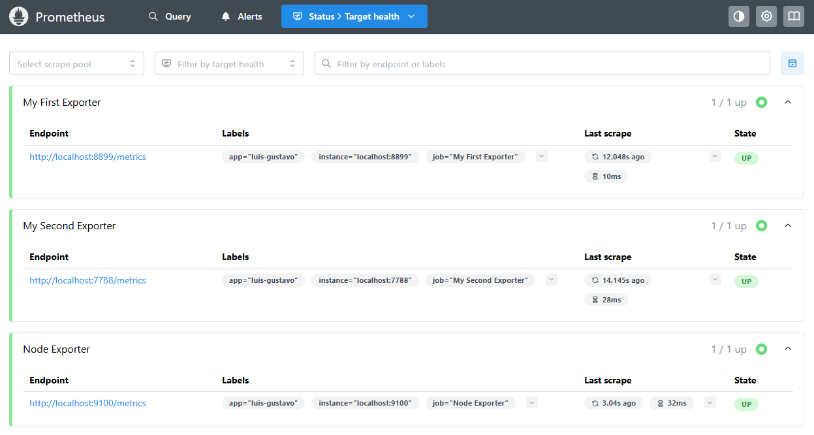
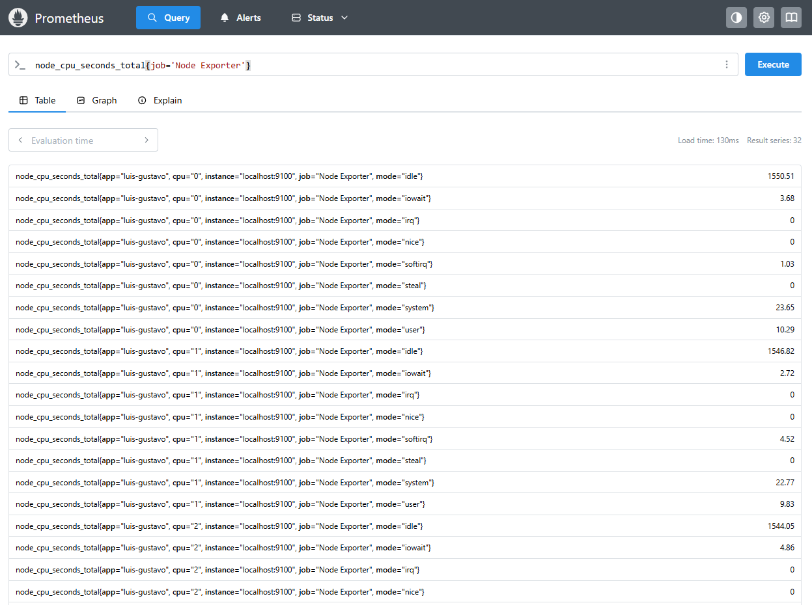

## Module 3 – Exporters and Metrics Collection

### What are we going to see today?

During **Module 3** of our learning journey with **Prometheus**, we will focus on understanding and learning how to **build exporters**, starting with our **second exporter**, this time written in **Go**.

We will also learn a lot about **operators**, such as `and` and `or`, and how to use them to create **more complex PromQL queries** that help us better understand what is happening with our services.

In addition, we will dive into the amazing **Node Exporter**: how to install it, configure it, and query the metrics it exposes.

And of course, we will run several queries throughout the module, just to keep the habit alive.

Finally, we will **install and configure Grafana**. Even though we will really start using it in the next module, we will already get it up and running here in **Module 3**, just to make it a little more eager for what’s coming next.

&nbsp;
### Creating Our Second Exporter

Now that we have already seen how to create an exporter, let’s create a **second exporter** to monitor the **memory consumption of our server**.

This time, we will build the exporter using **Go**, so before anything else, we need to install Go on our machine.

&nbsp;
### Installing Go

To install Go on **Ubuntu**, simply run the following command:

```bash
sudo apt install golang
```

If you are using another Linux distribution or a different operating system, check the official Go website for installation instructions.

&nbsp;
### Creating Our Exporter Using Go

Now let’s create our exporter.

Create a file called `second-exporter.go` inside the `second-exporter` directory and add the following code:

```GO
package main

import (
	"log"
	"net/http"

	"github.com/pbnjay/memory"
	"github.com/prometheus/client_golang/prometheus"
	"github.com/prometheus/client_golang/prometheus/promhttp"
)

func freeMemory() float64 {
	free_memory := memory.FreeMemory()
	return float64(free_memory)
}

func totalMemory() float64 {
	total_memory := memory.TotalMemory()
	return float64(total_memory)
}

var (
	freeMemoryBytesGauge = prometheus.NewGauge(prometheus.GaugeOpts{
		Name: "free_memory_bytes",
		Help: "Amount of free memory in bytes",
	})

	freeMemoryMegabytesGauge = prometheus.NewGauge(prometheus.GaugeOpts{
		Name: "free_memory_megabytes",
		Help: "Amount of free memory in megabytes",
	})

	totalMemoryBytesGauge = prometheus.NewGauge(prometheus.GaugeOpts{
		Name: "total_memory_bytes",
		Help: "Total amount of memory in bytes",
	})

	totalMemoryGigabytesGauge = prometheus.NewGauge(prometheus.GaugeOpts{
		Name: "total_memory_gigabytes",
		Help: "Total amount of memory in gigabytes",
	})
)

func init() {

	prometheus.MustRegister(freeMemoryBytesGauge)
	prometheus.MustRegister(freeMemoryMegabytesGauge)
	prometheus.MustRegister(totalMemoryBytesGauge)
	prometheus.MustRegister(totalMemoryGigabytesGauge)
}

func main() {
	freeMemoryBytesGauge.Set(freeMemory())
	freeMemoryMegabytesGauge.Set(freeMemory() / 1024 / 1024)
	totalMemoryBytesGauge.Set(totalMemory())
	totalMemoryGigabytesGauge.Set(totalMemory() / 1024 / 1024 / 1024)

	http.Handle("/metrics", promhttp.Handler())

	log.Fatal(http.ListenAndServe(":7788", nil))
}
```

The code above is fully commented, explaining what each line does, so I won’t go too deep into the code itself.

Basically, we are creating an exporter that exposes **four metrics**:

- `free_memory_bytes` – metric that returns the amount of free memory in bytes  
- `free_memory_megabytes` – metric that returns the amount of free memory in megabytes  
- `total_memory_bytes` – metric that returns the total amount of memory in bytes  
- `total_memory_gigabytes` – metric that returns the total amount of memory in gigabytes  

&nbsp;

Remember that we are using the `prometheus` package to create our exporter and `promhttp` to expose the metrics through a web server.  
We are also using the `memory` package to retrieve memory information from the server — thanks to GitHub user `pbnjay` for creating this library.

Additionally, we use the `log` package to log possible errors and the `net/http` package to create the web server.

&nbsp;
Now let’s compile our code and run the exporter. Before that, we need to install the libraries used in the project.

```BASH
go mod init segundo-exporter
go mod tidy
```

Now we can compile the code as shown below:

```BASH
go build second-exporter.go
```

Notice that a Go binary called second-exporter was generated. Let’s execute it:

```BASH
./second-exporter
```

We configured the exporter web server to run on port 7788.
Now access the URL `http://localhost:7788/metrics` to see the metrics exposed by the exporter.

You can check the metrics either using your browser or by running the `curl` command:

```BASH
curl http://localhost:7788/metrics
```

&nbsp;
#### Adding our exporter to a container

Now let’s add our second exporter to another container. To do that, create a file called `Dockerfile` inside the `second-exporter` directory with the following content:

```dockerfile
FROM golang:1.25.5-alpine3.23 AS build

WORKDIR /app

COPY go.mod go.sum ./
RUN go mod download

COPY . .

RUN CGO_ENABLED=0 GOOS=linux GOARCH=amd64 \
    go build -o second-exporter

FROM alpine:3.23
LABEL maintainer="Luis Gustavo Bordon"

WORKDIR /app
COPY --from=build /app/second-exporter /app/second-exporter

EXPOSE 7788
CMD ["./second-exporter"]
```

Now let’s build the image for our second exporter by running the following command:

```bash
docker build -t second-exporter:1.0 .
```

Great, it’s there! Now let’s run our second exporter:

```bash
docker run -d --name second-exporter -p 7788:7788 second-exporter:1.0
```

Now let’s access the metrics exposed by our second exporter:

```bash
curl http://localhost:7788/metrics
```

#### Adding the new Target to Prometheus

Now we can configure Prometheus to monitor our second exporter. To do that, we need to edit the `prometheus.yml` file and add the following content:

```yaml
global:
  scrape_interval: 15s # Set the scrape interval to every 15 seconds. Default is every 1 minute.
  evaluation_interval: 15s # Evaluate rules every 15 seconds. The default is every 1 minute.

rule_files:

scrape_configs:
  - job_name: "prometheus"
    static_configs:
      - targets: ["localhost:9090"]
        labels:
          app: "prometheus"

  - job_name: "My First Exporter"
    static_configs:
      - targets: ["localhost:8899"]
        labels:
          app: "luis-gustavo"

  - job_name: "My Second Exporter"
    static_configs:
      - targets: ["localhost:7788"]
        labels:
          app: "luis-gustavo"
```

Once that’s done, let’s restart Prometheus so it can load the new configuration.

```bash
systemctl restart prometheus
```

Our new target is now listed:


And our new metrics are available as well:


&nbsp;
### Functions

One very important thing is to feel comfortable using **PromQL**, because it is through it that we extract the maximum value from our metrics and from the amazing world of **time series**.

Let’s get to know some functions to build more effective queries. I’ll list a few here, and we’ll discover other functions as we move forward.

&nbsp;
#### The *rate* function

The `rate` function represents the **per-second average growth rate** of a given metric over a specific time interval.

```PROMQL
rate(metric)[5m]
```

Where `metric` is the metric you want to calculate the growth rate for over a 5-minute interval. You can use the `rate` function with both **gauge** and **counter** metrics.

Let’s look at a real example:

```PROMQL
rate(prometheus_http_requests_total{job="prometheus",handler="/api/v1/query"}[5m])
```

Here, we are calculating the average per-second growth rate of the `prometheus_http_requests_total` metric, filtering by `job` and `handler`, over a 5-minute interval. In this case, the goal is to understand the growth of queries being made to Prometheus.

&nbsp;
#### The *irate* function

The `irate` function represents the **per-second growth rate** of a given metric, but unlike the `rate` function, `irate` does **not** calculate an average over the interval. Instead, it uses **only the last two data points** to calculate the growth rate.

When visualized in a graph, you can clearly see the difference between `rate` and `irate`:  
while the graph using `rate` is smoother, the graph using `irate` is more **“spiky”**, making rises and drops much more noticeable.

```PROMQL
irate(metric[5m])
```

Where `metric` is the metric for which you want to calculate the growth rate, considering only the last two data points within a 5-minute interval.

Let’s look at a real example:

```PROMQL
irate(prometheus_http_requests_total{job="prometheus",handler="/api/v1/query"}[5m])
```

Here, we are calculating the per-second growth rate of the `prometheus_http_requests_total` metric, considering only the last two data points, filtering by `job` and `handler`, over a 5-minute interval. In this case, the goal is to understand the growth of queries being made to Prometheus.

&nbsp;
#### The *delta* function

The `delta` function represents the **difference between the current value and the previous value** of a metric over a given time range.

When we talk about `delta`, a common example is disk usage. For instance, if you want to know **how much disk was used during a specific time interval**, you can use the `delta` function to calculate the difference between the current and the previous value.

```PROMQL
delta(metric[5m])
```

Where `metric` is the metric for which you want to calculate the difference between the current and previous values over a 5-minute interval.

Let’s look at a real example:

```PROMQL
delta(prometheus_http_response_size_bytes_count{job="prometheus",handler="/api/v1/query"}[5m])
```

Here, we are calculating the difference between the current and previous values of the `prometheus_http_response_size_bytes_count` metric, filtering by `job` and `handler`, over a 5-minute interval.  
In this case, the goal is to understand how many bytes are being consumed by the queries made to Prometheus.

&nbsp;
#### The *increase* function

Similar to the `delta` function, the `increase` function represents the **difference between the first and last values** over a given time range.  
The key difference is that `increase` assumes the metric is a **counter**, meaning the value is incremented every time the metric is updated.

It starts at `0` and keeps adding up as the metric increases.

You can probably already guess which type of metric this function works with, right?  
Exactly: **Counter**.

```PROMQL
increase(metric[5m])
```

Where `metric` is the metric for which you want to calculate the difference between the first and last values over a 5-minute interval.

Let’s look at a real example:

```PROMQL
increase(prometheus_http_requests_total{job="prometheus",handler="/api/v1/query"}[5m])
```

Here, we are calculating the difference between the first and last values of the `prometheus_http_requests_total` metric, filtering by `job` and `handler`, over a 5-minute interval.

You can follow the result of this query by clicking on `Graph` and then `Execute`. This will display a graph with the query result, making it much easier to understand the behavior of the metric.

&nbsp;
#### The *sum* function

The `sum` function represents the **sum of all values** of a metric.  
You can use the `sum` function with `counter`, `gauge`, `histogram`, and `summary` metric types.

A common use case for the `sum` function is when you want to know **how much memory is being used by all your containers**, or **how much memory is being used by all your pods**.

```PROMQL
sum(metric)
```

Where `metric` is the metric you want to sum.

Let’s look at a real example:

```PROMQL
sum(go_memstats_alloc_bytes{job="prometheus"})
```

Here, we are summing all values of the `go_memstats_alloc_bytes` metric, filtering by `job`.

&nbsp;
#### The *count* function

Another widely used function is `count`, which represents the **number of elements** in a metric.  
You can use the `count` function with `counter`, `gauge`, `histogram`, and `summary` metric types.

A common use case is when you want to know **how many containers are running at a given moment** or **how many pods are currently running**.

```PROMQL
count(metric)
```

Where `metric` is the metric you want to count.

Let’s look at a real example:

```PROMQL
count(prometheus_http_requests_total)
```

The result will be the number of values that the `prometheus_http_requests_total` metric has.

&nbsp;
#### The *avg* function

The `avg` function represents the **average value** of a metric.  
You can use the `avg` function with `counter`, `gauge`, `histogram`, and `summary` metric types.

This is one of the most commonly used functions, since it is very common to want to know the **average value** of a metric, such as the average memory usage of a container.

```PROMQL
avg(metric)
```

Where `metric` is the metric for which you want to calculate the average.

&nbsp;
#### The *min* function

The `min` function represents the **minimum value** of a metric.  
You can use the `min` function with `counter`, `gauge`, `histogram`, and `summary` metric types.

A common use case is when you want to know the **lowest memory usage** of a container.

```PROMQL
min(metric)
```

Where `metric` is the metric for which you want to calculate the minimum value.

&nbsp;
#### The *max* function

The `max` function represents the **maximum value** of a metric.  
A common use case is when you want to know the **highest memory usage across the nodes of a Kubernetes cluster**.

```PROMQL
max(metric)
```

Where `metric` is the metric for which you want to calculate the maximum value.

&nbsp;
#### The *avg_over_time* function

The `avg_over_time` function represents the **average value of a metric over a time range**.

It is commonly used to calculate averages over time, such as the average number of requests per second over a given interval, or even the average number of people in space over the last year.

```PROMQL
avg_over_time(metric[5m])
```

Where `metric` is the metric for which you want to calculate the average over a 5-minute interval.

Let’s look at a real example:

```PROMQL
avg_over_time(prometheus_http_requests_total{handler="/api/v1/query"}[5m])
```

Here, we are calculating the average of the `prometheus_http_requests_total` metric, filtering by `handler`, over a 5-minute interval.

&nbsp;
#### The *sum_over_time* function

The `sum_over_time` function represents the **sum of a metric over a time range**.  
While `avg_over_time` calculates the average, `sum_over_time` calculates the total sum of values over the interval.

For example, you might calculate the total number of requests over a period of time, or the total number of people in space over the last year.

```PROMQL
sum_over_time(metric[5m])
```

Where `metric` is the metric for which you want to calculate the sum over a 5-minute interval.

Let’s look at a real example:

```PROMQL
sum_over_time(prometheus_http_requests_total{handler="/api/v1/query"}[5m])
```

Here, we are calculating the sum of the `prometheus_http_requests_total` metric, filtering by `handler`, over a 5-minute interval.

&nbsp;
#### The *max_over_time* function

The `max_over_time` function represents the **maximum value of a metric over a time range**.

```PROMQL
max_over_time(metric[5m])
```

Where `metric` is the metric for which you want to calculate the maximum value over a 5-minute interval.

Let’s look at a real example:

```PROMQL
max_over_time(prometheus_http_requests_total{handler="/api/v1/query"}[5m])
```

Here, we are retrieving the maximum value of the `prometheus_http_requests_total` metric, filtering by `handler`, over a 5-minute interval.

&nbsp;
#### The *min_over_time* function

The `min_over_time` function represents the **minimum value of a metric over a time range**.

```PROMQL
min_over_time(metric[5m])
```

Where `metric` is the metric for which you want to calculate the minimum value over a 5-minute interval.

Let’s look at a real example:

```PROMQL
min_over_time(prometheus_http_requests_total{handler="/api/v1/query"}[5m])
```

Here, we are retrieving the minimum value of the `prometheus_http_requests_total` metric, filtering by `handler`, over a 5-minute interval.

&nbsp;
#### The *stddev_over_time* function

The `stddev_over_time` function represents the **standard deviation** of a metric over a time range.  
Standard deviation shows how far values are from the average and is very useful for detecting anomalies, such as unexpected spikes in disk usage.

```PROMQL
stddev_over_time(metric[5m])
```

Where `metric` is the metric for which you want to calculate the standard deviation over a 5-minute interval.

Let’s look at a real example:

```PROMQL
stddev_over_time(prometheus_http_requests_total{handler="/api/v1/query"}[10m])
```

Here, we are calculating the standard deviation of the `prometheus_http_requests_total` metric, filtering by `handler`, over a 10-minute interval.  
It is highly recommended to check the graph view, as it makes visualizing deviations much easier.

&nbsp;
#### The *by* function

The powerful and widely used `by` function is used to **group metrics by labels**.

For example, if you want to group all metrics by the `job` label, you can use `by` like this:

```PROMQL
sum(metric) by (job)
```

Where `metric` is the metric you want to group and `job` is the label used for grouping.

Let’s look at a real example:

```PROMQL
sum(prometheus_http_requests_total) by (code)
```

Here, we are summing the `prometheus_http_requests_total` metric and grouping it by the `code` label.  
This allows us to see how many requests were made per HTTP response code.

&nbsp;
#### The *without* function

The `without` function is used to **remove labels from a metric**.  
You can use `without` with `counter`, `gauge`, `histogram`, and `summary` metric types, and it is often used together with the `sum` function.

For example, if you want to remove the `job` label from a metric, you can do the following:

```PROMQL
sum(metric) without (job)
```

Where `metric` is the metric from which you want to remove the `job` label.

Let’s look at a real example:

```PROMQL
sum(prometheus_http_requests_total) without (handler)
```

Here, we are summing the `prometheus_http_requests_total` metric and removing the `handler` label.  
This gives us a more general view of the total number of requests by response code, without focusing on which handler was used.

&nbsp;
#### The *histogram_quantile* and *quantile* functions

The `histogram_quantile` and `quantile` functions are very similar, but they are used with different metric types:

- `histogram_quantile` is used with **histogram** metrics
- `quantile` is used with **summary** metrics

These functions are commonly used to calculate **percentiles** of a metric.

```PROMQL
quantile(0.95, metric)
```

Where `metric` is the metric for which you want to calculate the percentile, and `0.95` represents the 95th percentile.

Let’s look at a real example:

```PROMQL
quantile(0.95, prometheus_http_request_duration_seconds_bucket)
```

Here, we are calculating the 95th percentile of the `prometheus_http_request_duration_seconds_bucket` metric.  
This allows us to understand the response time for 95% of the requests.

&nbsp;
### Operators

We need to talk about **operators**, they are extremely important to unlock even more power from our beloved PromQL and obtain more meaningful and interesting results.

Let’s get to know some of them.

&nbsp;
#### Equality operator

The equality operator is used to compare whether two values are equal.

```PROMQL
metric == 1
```

Where `metric` is the metric you want to compare and `1` is the value you are comparing against.  
If the metric value is equal to `1`, the result will be **true**.

&nbsp;
#### Not equal operator

The not equal operator is used to compare whether two values are different.

```PROMQL
metric != 1
```

Where `metric` is the metric you want to compare and `1` is the value you are comparing against.  
If the metric value is different from `1`, the result will be **true**.

&nbsp;
#### Greater than operator

The greater than operator is used to compare whether one value is greater than another.

```PROMQL
metric > 1
```

Where `metric` is the metric you want to compare and `1` is the value you are comparing against.  
If the metric value is greater than `1`, the result will be **true**.

&nbsp;
#### Less than operator

The less than operator is used to compare whether one value is less than another.

```PROMQL
metric < 1
```

Where `metric` is the metric you want to compare and `1` is the value you are comparing against.  
If the metric value is less than `1`, the result will be **true**.

&nbsp;
#### Greater than or equal operator

The greater than or equal operator is used to compare whether one value is greater than or equal to another.

```PROMQL
metric >= 1
```

Where `metric` is the metric you want to compare and `1` is the value you are comparing against.  
If the metric value is greater than or equal to `1`, the result will be **true**.

&nbsp;
#### Less than or equal operator

The less than or equal operator is used to compare whether one value is less than or equal to another.

```PROMQL
metric <= 1
```

Where `metric` is the metric you want to compare and `1` is the value you are comparing against.  
If the metric value is less than or equal to `1`, the result will be **true**.

&nbsp;
#### Multiplication operator

The multiplication operator is used to multiply two values.

```PROMQL
metric * 1
```

Where `metric` is the metric you want to multiply and `1` is the value used in the multiplication.  
If the metric value is multiplied by `1`, the result will be the same value of the metric.

&nbsp;
#### Division operator

The division operator is used to divide two values.

```PROMQL
metric / 1
```

Where `metric` is the metric you want to divide and `1` is the divisor.  
The result will be the metric value divided by the provided value.

&nbsp;
#### Addition operator

The addition operator is used to add two values.

```PROMQL
metric + 1
```

Where `metric` is the metric you want to add to and `1` is the value you want to add.  
The result will be the metric value plus the given value.

&nbsp;
#### Subtraction operator

The subtraction operator is used to subtract one value from another.

```PROMQL
metric - 1
```

Where `metric` is the metric you want to subtract from and `1` is the value to subtract.  
The result will be the metric value minus the given value.

&nbsp;
#### Modulo operator

The modulo operator is used to get the remainder of a division between two values.

```PROMQL
metric % 1
```

Where `metric` is the metric for which you want the remainder and `1` is the divisor.  
The result will be the remainder of the division.

&nbsp;
#### Exponentiation operator

The exponentiation operator is used to raise a value to a power.

```PROMQL
metric ^ 1
```

Where `metric` is the metric you want to raise and `1` is the exponent.  
The result will be the metric value raised to the given power.

&nbsp;
#### Grouping operator

The grouping operator is used to group expressions.

```PROMQL
(metric + 1) / 2
```

Notice that the parentheses are used to group the expression `(metric + 1)`.  
This part of the expression is evaluated first, and then the result is divided by `2`.

&nbsp;
#### String concatenation operator

The concatenation operator is used to concatenate strings.

```PROMQL
"string_a" + "string_b"
```

Where `string_a` is the first string and `string_b` is the second string.  
The result will be a single string containing both values concatenated.

&nbsp;
#### String comparison operator

The string comparison operator is used to compare whether two strings are equal.

```PROMQL
"string_a" == "string_b"
```

Where `string_a` is the first string and `string_b` is the second string.  
The result will be **true** if both strings are equal.

&nbsp;
#### Enough operators for today

As you continue your studies, you will notice how powerful these operators are for building more complex expressions and creating more precise alerts.

There are still some operators that were not covered here, but you can find them in the official Prometheus documentation and throughout the rest of this training.

&nbsp;
### Node Exporter

We need to talk about the most famous exporter in the Prometheus universe: the amazing **Node Exporter**.  
With Node Exporter, you can collect metrics from a Linux server or macOS machines, such as CPU usage, disk usage, memory consumption, open files, and much more.

Node Exporter is an open-source project written in Go. It runs on Linux as a service and collects and exposes operating system metrics.

&nbsp;
#### Collectors

Node Exporter has **collectors**, which are responsible for capturing operating system metrics.  
By default, Node Exporter comes with many collectors enabled, but you can enable others if needed.

To check the list of collectors enabled by default, visit:

[List of collectors enabled by default](https://github.com/prometheus/node_exporter#enabled-by-default)

&nbsp;
There is also a list of collectors that are disabled by default:

[List of collectors disabled by default](https://github.com/prometheus/node_exporter#disabled-by-default)

&nbsp;
Here are some very useful collectors:

* `arp`: Collects ARP (Address Resolution Protocol) metrics, such as the number of ARP entries and ARP resolutions.
* `bonding`: Collects metrics from bonded network interfaces.
* `conntrack`: Collects Netfilter connection metrics, such as the number of active and tracked connections.
* `cpu`: Collects CPU metrics.
* `diskstats`: Collects disk I/O metrics, such as read and write operations.
* `filefd`: Collects metrics about open file descriptors.
* `filesystem`: Collects filesystem metrics, such as size and usage.
* `hwmon`: Collects hardware metrics, such as temperature.
* `ipvs`: Collects IPVS metrics.
* `loadavg`: Collects system load average metrics.
* `mdadm`: Collects RAID metrics, such as the number of active disks.
* `meminfo`: Collects memory metrics, such as memory usage, buffers, and cache.
* `netdev`: Collects network metrics, such as received and transmitted packets.
* `netstat`: Collects network metrics, such as TCP and UDP connections.
* `os`: Collects operating system metrics.
* `selinux`: Collects SELinux metrics, such as status and policies.
* `sockstat`: Collects socket metrics.
* `stat`: Collects system statistics, such as uptime and forks.
* `time`: Collects time-related metrics, such as clock synchronization.
* `uname`: Collects system information metrics.
* `vmstat`: Collects virtual memory metrics.

Later on, we will see how to enable or disable collectors in Node Exporter.

&nbsp;
#### Installing Node Exporter on Linux

Let’s install Node Exporter so we can have even more metrics to play with in Prometheus — and, of course, get to know this exporter that is basically the default choice in most environments when it comes to Linux server metrics.

Node Exporter is a single binary that must be downloaded from the official project website.

Below is the download URL for Node Exporter:

```bash
https://prometheus.io/download/#node_exporter
```

Access the URL and check the latest available version.  
At the time of writing this material, the latest version is **1.10.2**.

Let’s download the Node Exporter binary:

```bash
wget https://github.com/prometheus/node_exporter/releases/download/v1.10.2/node_exporter-1.10.2.linux-amd64.tar.gz
```

Now let’s extract the file:

```bash
tar -xvzf node_exporter-1.10.2.linux-amd64.tar.gz
```

As mentioned before, Node Exporter is just a Go binary, so installing it on a Linux machine is very straightforward.  
Basically, we will follow the same process used to install Prometheus.

Let’s move the `node_exporter` binary to `/usr/local/bin`:

```bash
sudo mv node_exporter-1.10.2.linux-amd64/node_exporter /usr/local/bin/
```

Let’s verify that everything is working correctly:

```bash
node_exporter --version
```

The output should look similar to this:

```bash
node_exporter, version 1.10.2 (branch: HEAD, revision: 654f19dee6a0c41de78a8d6d870e8c742cdb43b9)
  build user:       root@b29b4019149a
  build date:       20251025-20:05:32
  go version:       go1.25.3
  platform:         linux/amd64
  tags:             unknown
```

All good — let’s continue with the installation.

Now let’s create the `node_exporter` user, which will be responsible for running the service:

```bash
sudo addgroup --system node_exporter
sudo adduser --shell /sbin/nologin --system --group node_exporter
```

Now let’s create the Node Exporter systemd service file:

```bash
sudo vim /etc/systemd/system/node_exporter.service
```

Add the following content:

```bash
[Unit]
Description=Node Exporter
Wants=network-online.target
After=network-online.target

[Service]
User=node_exporter
Group=node_exporter
Type=simple
ExecStart=/usr/local/bin/node_exporter

[Install]
WantedBy=multi-user.target
```

As you already know, every time we add a new systemd service, we need to reload systemd:

```bash
sudo systemctl daemon-reload
```

Now let’s start the service:

```bash
sudo systemctl start node_exporter
```

Let’s check if everything is running smoothly:

```bash
sudo systemctl status node_exporter
```

It’s always great to see this output when creating and starting a new service:

```bash
Loaded: loaded (/etc/systemd/system/node_exporter.service; enabled; preset: enabled)
     Active: active (running) since Tue 2025-12-16 23:01:00 UTC; 5min ago
   Main PID: 821 (node_exporter)
      Tasks: 7 (limit: 9433)
     Memory: 22.9M (peak: 24.1M)
        CPU: 848ms
     CGroup: /system.slice/node_exporter.service
             └─821 /usr/local/bin/node_exporter
```

Our beloved Node Exporter is running!  
Now let’s enable the service so it starts automatically when the server reboots:

```bash
sudo systemctl enable node_exporter
```

It’s important to mention that Node Exporter runs on port **9100**.  
To access the collected metrics, simply open:

```bash
http://localhost:9100/metrics
```

Before checking the metrics, let’s confirm that Node Exporter is listening on port 9100.  
We can use the `ss` command to check open TCP and UDP connections:

```bash
ss -atunp | grep 9100
```

The output should look like this:

```bash
tcp   LISTEN    0      4096   *:9100   *:*
```

Perfect! Everything is working as expected.  
Now let’s check the metrics collected by Node Exporter:

```bash
curl http://localhost:9100/metrics
```

Remember to replace `localhost` with your machine’s IP address if Node Exporter is running on another host.

When you look at the Node Exporter metrics output, you’ll notice it’s huge — more than 2,000 metrics.  
That’s a lot of data!

&nbsp;
## Adding Node Exporter to Prometheus

Remember that these metrics are not yet available in Prometheus. For them to be collected, we need to configure Prometheus to scrape Node Exporter metrics. In other words, we must configure Prometheus to perform a `scrape` on Node Exporter. To do this, we need to create a new `job` in the Prometheus configuration file to define our new `target`.

Let’s add the following content to the Prometheus configuration file:

```bash
- job_name: 'node_exporter'
  static_configs:
    - targets: ['localhost:9100']
```

**Important**: Remember to replace `localhost` with your machine’s IP address if you installed Node Exporter on a different machine.

The configuration file should look like this:

```bash
global:
  scrape_interval: 15s
  evaluation_interval: 15s

rule_files:

scrape_configs:
  - job_name: "prometheus"
    static_configs:
      - targets: ["localhost:9090"]
        labels:
          app: "prometheus"

  - job_name: "My First Exporter"
    static_configs:
      - targets: ["localhost:8899"]
        labels:
          app: "luis-gustavo"

  - job_name: "My Second Exporter"
    static_configs:
      - targets: ["localhost:7788"]
        labels:
          app: "luis-gustavo"

  - job_name: "Node Exporter"
    static_configs:
      - targets: ["localhost:9100"]
        labels:
          app: "luis-gustavo"
```

I won’t even comment on the file here, because you already know how the Prometheus configuration file works, right?

Now let’s restart Prometheus so it can load the new configuration:

```bash
sudo systemctl restart prometheus
```

Let’s check if our new `job` was created successfully:

```bash
curl http://localhost:9090/targets
```

If you want to see the new target via the Prometheus web interface, just access the URL `http://localhost:9090/targets`. Take a look at the screenshot below:



The new `job` is there, successfully created. Now let’s check if Prometheus is collecting Node Exporter metrics. We’ll pass the `job` name to Prometheus to make the query more specific:

```bash
curl -GET http://localhost:9090/api/v1/query --data-urlencode "query=node_cpu_seconds_total{job='Node Exporter'}" | jq .
```

The output is quite large, and the machine I’m testing has 4 CPUs, so I’ll show only a small part of it:

```json
{
  "status": "success",
  "data": {
    "resultType": "vector",
	"result": [
      {
        "metric": {
          "__name__": "node_cpu_seconds_total",
          "app": "luis-gustavo",
          "cpu": "0",
          "instance": "localhost:9100",
          "job": "Node Exporter",
          "mode": "idle"
        },
        "value": [
          1765927509.818,
          "1391.84"
        ]
      }
    ]
  }
}
```

Now let’s run the same query using the Prometheus web interface:



&nbsp;
## Enabling New Collectors in Node Exporter

One very interesting aspect of Node Exporter is the number of `collectors` it provides. These collectors are responsible for gathering metrics from different system components. For example, if you want to monitor services managed by `systemd`, you can enable the `systemd` collector in Node Exporter.

The first step is to create a new file where we will define all collectors we want to enable in Node Exporter. In our case, we will enable only the `systemd` collector.

Let’s create the directory `/etc/node_exporter/` (if it does not exist) and the file `/etc/node_exporter/node_exporter_options`:

```bash
sudo mkdir /etc/node_exporter
sudo vim /etc/node_exporter/node_exporter_options
```

&nbsp;

Now add the environment variable `OPTIONS` to the file:

```bash
OPTIONS="--collector.systemd"
```

Adjust the permissions of the directory and file:

```bash
sudo chown -R node_exporter:node_exporter /etc/node_exporter/
```

Now update the Node Exporter systemd service file to load this environment variable. The service file should look like this:

```bash
[Unit]
Description=Node Exporter
Wants=network-online.target
After=network-online.target

[Service]
User=node_exporter
Group=node_exporter
Type=simple
EnvironmentFile=/etc/node_exporter/node_exporter_options
ExecStart=/usr/local/bin/node_exporter $OPTIONS

[Install]
WantedBy=multi-user.target
```

Reload systemd and restart Node Exporter so it applies the new configuration:

```bash
sudo systemctl daemon-reload
sudo systemctl restart node_exporter
```

Now let’s check if Node Exporter is collecting `systemd` metrics:

```bash
curl -GET http://localhost:9100/metrics | grep systemd
```

The output is quite large, so here is just a small portion of it:

```bash
node_scrape_collector_success{collector="systemd"} 1
node_systemd_socket_accepted_connections_total{name="docker.socket"} 0
node_systemd_socket_accepted_connections_total{name="snapd.socket"} 0
```

Done! Task completed — and very easy to do. Now you know how to enable new collectors in Node Exporter and collect additional metrics!

&nbsp;
## Some Queries Using Node Exporter Metrics

Now that we know how to collect Node Exporter metrics, let’s run some queries.

&nbsp;
### 1. How many CPUs does my machine have?

```bash
count(node_cpu_seconds_total{job='Node Exporter', mode='idle'})
```

This query counts how many `node_cpu_seconds_total` metrics exist with `mode="idle"`. The result represents the number of CPUs on the machine.

&nbsp;
### 2. What is the CPU usage percentage?

```bash
100 - avg by (cpu) (irate(node_cpu_seconds_total{job='Node Exporter', mode='idle'}[5m])) * 100
```

This query calculates CPU usage by subtracting idle time from 100%, using a 5-minute `irate`.

&nbsp;
### 3. What is the memory usage percentage?

```bash
100 - (node_memory_MemAvailable_bytes / node_memory_MemTotal_bytes) * 100
```

This query calculates memory usage by subtracting available memory from total memory.

&nbsp;
### 4. What is the disk usage percentage?

```bash
100 - (node_filesystem_avail_bytes{mountpoint="/"} / node_filesystem_size_bytes{mountpoint="/"}) * 100
```

This query calculates disk usage for the root filesystem.

&nbsp;
### 5. How much disk space is used on `/` in gigabytes?

```bash
(node_filesystem_size_bytes{mountpoint="/"} - node_filesystem_avail_bytes{mountpoint="/"}) / 1024 / 1024 / 1024
```

This query calculates the used disk space in gigabytes.

Simple, clean, and powerful — now you’re fully equipped to build great Prometheus queries!
