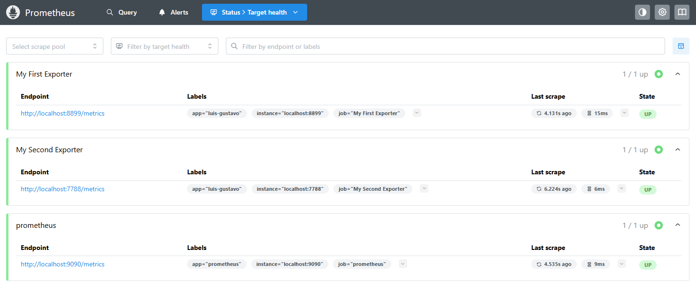
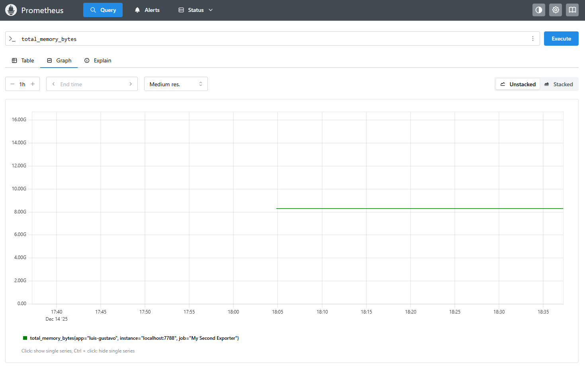

## Module 3 – Exporters and Metrics Collection

### What are we going to see today?

During **Module 3** of our learning journey with **Prometheus**, we will focus on understanding and learning how to **build exporters**, starting with our **second exporter**, this time written in **Go**.

We will also learn a lot about **operators**, such as `and` and `or`, and how to use them to create **more complex PromQL queries** that help us better understand what is happening with our services.

In addition, we will dive into the amazing **Node Exporter**: how to install it, configure it, and query the metrics it exposes.

And of course, we will run several queries throughout the module, just to keep the habit alive.

Finally, we will **install and configure Grafana**. Even though we will really start using it in the next module, we will already get it up and running here in **Module 3**, just to make it a little more eager for what’s coming next.

&nbsp;
### Creating Our Second Exporter

Now that we have already seen how to create an exporter, let’s create a **second exporter** to monitor the **memory consumption of our server**.

This time, we will build the exporter using **Go**, so before anything else, we need to install Go on our machine.

&nbsp;
### Installing Go

To install Go on **Ubuntu**, simply run the following command:

```bash
sudo apt install golang
```

If you are using another Linux distribution or a different operating system, check the official Go website for installation instructions.

&nbsp;
### Creating Our Exporter Using Go

Now let’s create our exporter.

Create a file called `second-exporter.go` inside the `second-exporter` directory and add the following code:

```GO
package main

import (
	"log"
	"net/http"

	"github.com/pbnjay/memory"
	"github.com/prometheus/client_golang/prometheus"
	"github.com/prometheus/client_golang/prometheus/promhttp"
)

func freeMemory() float64 {
	free_memory := memory.FreeMemory()
	return float64(free_memory)
}

func totalMemory() float64 {
	total_memory := memory.TotalMemory()
	return float64(total_memory)
}

var (
	freeMemoryBytesGauge = prometheus.NewGauge(prometheus.GaugeOpts{
		Name: "free_memory_bytes",
		Help: "Amount of free memory in bytes",
	})

	freeMemoryMegabytesGauge = prometheus.NewGauge(prometheus.GaugeOpts{
		Name: "free_memory_megabytes",
		Help: "Amount of free memory in megabytes",
	})

	totalMemoryBytesGauge = prometheus.NewGauge(prometheus.GaugeOpts{
		Name: "total_memory_bytes",
		Help: "Total amount of memory in bytes",
	})

	totalMemoryGigabytesGauge = prometheus.NewGauge(prometheus.GaugeOpts{
		Name: "total_memory_gigabytes",
		Help: "Total amount of memory in gigabytes",
	})
)

func init() {

	prometheus.MustRegister(freeMemoryBytesGauge)
	prometheus.MustRegister(freeMemoryMegabytesGauge)
	prometheus.MustRegister(totalMemoryBytesGauge)
	prometheus.MustRegister(totalMemoryGigabytesGauge)
}

func main() {
	freeMemoryBytesGauge.Set(freeMemory())
	freeMemoryMegabytesGauge.Set(freeMemory() / 1024 / 1024)
	totalMemoryBytesGauge.Set(totalMemory())
	totalMemoryGigabytesGauge.Set(totalMemory() / 1024 / 1024 / 1024)

	http.Handle("/metrics", promhttp.Handler())

	log.Fatal(http.ListenAndServe(":7788", nil))
}
```

The code above is fully commented, explaining what each line does, so I won’t go too deep into the code itself.

Basically, we are creating an exporter that exposes **four metrics**:

- `free_memory_bytes` – metric that returns the amount of free memory in bytes  
- `free_memory_megabytes` – metric that returns the amount of free memory in megabytes  
- `total_memory_bytes` – metric that returns the total amount of memory in bytes  
- `total_memory_gigabytes` – metric that returns the total amount of memory in gigabytes  

&nbsp;

Remember that we are using the `prometheus` package to create our exporter and `promhttp` to expose the metrics through a web server.  
We are also using the `memory` package to retrieve memory information from the server — thanks to GitHub user `pbnjay` for creating this library.

Additionally, we use the `log` package to log possible errors and the `net/http` package to create the web server.

&nbsp;
Now let’s compile our code and run the exporter. Before that, we need to install the libraries used in the project.

```BASH
go mod init segundo-exporter
go mod tidy
```

Now we can compile the code as shown below:

```BASH
go build second-exporter.go
```

Notice that a Go binary called second-exporter was generated. Let’s execute it:

```BASH
./second-exporter
```

We configured the exporter web server to run on port 7788.
Now access the URL `http://localhost:7788/metrics` to see the metrics exposed by the exporter.

You can check the metrics either using your browser or by running the `curl` command:

```BASH
curl http://localhost:7788/metrics
```

&nbsp;
#### Adding our exporter to a container

Now let’s add our second exporter to another container. To do that, create a file called `Dockerfile` inside the `second-exporter` directory with the following content:

```dockerfile
FROM golang:1.25.5-alpine3.23 AS build

WORKDIR /app

COPY go.mod go.sum ./
RUN go mod download

COPY . .

RUN CGO_ENABLED=0 GOOS=linux GOARCH=amd64 \
    go build -o second-exporter

FROM alpine:3.23
LABEL maintainer="Luis Gustavo Bordon"

WORKDIR /app
COPY --from=build /app/second-exporter /app/second-exporter

EXPOSE 7788
CMD ["./second-exporter"]
```

Now let’s build the image for our second exporter by running the following command:

```bash
docker build -t second-exporter:1.0 .
```

Great, it’s there! Now let’s run our second exporter:

```bash
docker run -d --name second-exporter -p 7788:7788 second-exporter:1.0
```

Now let’s access the metrics exposed by our second exporter:

```bash
curl http://localhost:7788/metrics
```

#### Adding the new Target to Prometheus

Now we can configure Prometheus to monitor our second exporter. To do that, we need to edit the `prometheus.yml` file and add the following content:

```yaml
global:
  scrape_interval: 15s # Set the scrape interval to every 15 seconds. Default is every 1 minute.
  evaluation_interval: 15s # Evaluate rules every 15 seconds. The default is every 1 minute.

rule_files:

scrape_configs:
  - job_name: "prometheus"
    static_configs:
      - targets: ["localhost:9090"]
        labels:
          app: "prometheus"

  - job_name: "My First Exporter"
    static_configs:
      - targets: ["localhost:8899"]
        labels:
          app: "luis-gustavo"

  - job_name: "My Second Exporter"
    static_configs:
      - targets: ["localhost:7788"]
        labels:
          app: "luis-gustavo"
```

Once that’s done, let’s restart Prometheus so it can load the new configuration.

```bash
systemctl restart prometheus
```

Our new target is now listed:



And our new metrics are available as well:



&nbsp;
### Functions

One very important thing is to feel comfortable using **PromQL**, because it is through it that we extract the maximum value from our metrics and from the amazing world of **time series**.

Let’s get to know some functions to build more effective queries. I’ll list a few here, and we’ll discover other functions as we move forward.

&nbsp;
#### The *rate* function

The `rate` function represents the **per-second average growth rate** of a given metric over a specific time interval.

```PROMQL
rate(metric)[5m]
```

Where `metric` is the metric you want to calculate the growth rate for over a 5-minute interval. You can use the `rate` function with both **gauge** and **counter** metrics.

Let’s look at a real example:

```PROMQL
rate(prometheus_http_requests_total{job="prometheus",handler="/api/v1/query"}[5m])
```

Here, we are calculating the average per-second growth rate of the `prometheus_http_requests_total` metric, filtering by `job` and `handler`, over a 5-minute interval. In this case, the goal is to understand the growth of queries being made to Prometheus.

&nbsp;
#### The *irate* function

The `irate` function represents the **per-second growth rate** of a given metric, but unlike the `rate` function, `irate` does **not** calculate an average over the interval. Instead, it uses **only the last two data points** to calculate the growth rate.

When visualized in a graph, you can clearly see the difference between `rate` and `irate`:  
while the graph using `rate` is smoother, the graph using `irate` is more **“spiky”**, making rises and drops much more noticeable.

```PROMQL
irate(metric[5m])
```

Where `metric` is the metric for which you want to calculate the growth rate, considering only the last two data points within a 5-minute interval.

Let’s look at a real example:

```PROMQL
irate(prometheus_http_requests_total{job="prometheus",handler="/api/v1/query"}[5m])
```

Here, we are calculating the per-second growth rate of the `prometheus_http_requests_total` metric, considering only the last two data points, filtering by `job` and `handler`, over a 5-minute interval. In this case, the goal is to understand the growth of queries being made to Prometheus.

&nbsp;
#### The *delta* function

The `delta` function represents the **difference between the current value and the previous value** of a metric over a given time range.

When we talk about `delta`, a common example is disk usage. For instance, if you want to know **how much disk was used during a specific time interval**, you can use the `delta` function to calculate the difference between the current and the previous value.

```PROMQL
delta(metric[5m])
```

Where `metric` is the metric for which you want to calculate the difference between the current and previous values over a 5-minute interval.

Let’s look at a real example:

```PROMQL
delta(prometheus_http_response_size_bytes_count{job="prometheus",handler="/api/v1/query"}[5m])
```

Here, we are calculating the difference between the current and previous values of the `prometheus_http_response_size_bytes_count` metric, filtering by `job` and `handler`, over a 5-minute interval.  
In this case, the goal is to understand how many bytes are being consumed by the queries made to Prometheus.

&nbsp;
#### The *increase* function

Similar to the `delta` function, the `increase` function represents the **difference between the first and last values** over a given time range.  
The key difference is that `increase` assumes the metric is a **counter**, meaning the value is incremented every time the metric is updated.

It starts at `0` and keeps adding up as the metric increases.

You can probably already guess which type of metric this function works with, right?  
Exactly: **Counter**.

```PROMQL
increase(metric[5m])
```

Where `metric` is the metric for which you want to calculate the difference between the first and last values over a 5-minute interval.

Let’s look at a real example:

```PROMQL
increase(prometheus_http_requests_total{job="prometheus",handler="/api/v1/query"}[5m])
```

Here, we are calculating the difference between the first and last values of the `prometheus_http_requests_total` metric, filtering by `job` and `handler`, over a 5-minute interval.

You can follow the result of this query by clicking on `Graph` and then `Execute`. This will display a graph with the query result, making it much easier to understand the behavior of the metric.

&nbsp;
#### The *sum* function

The `sum` function represents the **sum of all values** of a metric.  
You can use the `sum` function with `counter`, `gauge`, `histogram`, and `summary` metric types.

A common use case for the `sum` function is when you want to know **how much memory is being used by all your containers**, or **how much memory is being used by all your pods**.

```PROMQL
sum(metric)
```

Where `metric` is the metric you want to sum.

Let’s look at a real example:

```PROMQL
sum(go_memstats_alloc_bytes{job="prometheus"})
```

Here, we are summing all values of the `go_memstats_alloc_bytes` metric, filtering by `job`.

&nbsp;
#### The *count* function

Another widely used function is `count`, which represents the **number of elements** in a metric.  
You can use the `count` function with `counter`, `gauge`, `histogram`, and `summary` metric types.

A common use case is when you want to know **how many containers are running at a given moment** or **how many pods are currently running**.

```PROMQL
count(metric)
```

Where `metric` is the metric you want to count.

Let’s look at a real example:

```PROMQL
count(prometheus_http_requests_total)
```

The result will be the number of values that the `prometheus_http_requests_total` metric has.

&nbsp;
#### The *avg* function

The `avg` function represents the **average value** of a metric.  
You can use the `avg` function with `counter`, `gauge`, `histogram`, and `summary` metric types.

This is one of the most commonly used functions, since it is very common to want to know the **average value** of a metric, such as the average memory usage of a container.

```PROMQL
avg(metric)
```

Where `metric` is the metric for which you want to calculate the average.

&nbsp;
#### The *min* function

The `min` function represents the **minimum value** of a metric.  
You can use the `min` function with `counter`, `gauge`, `histogram`, and `summary` metric types.

A common use case is when you want to know the **lowest memory usage** of a container.

```PROMQL
min(metric)
```

Where `metric` is the metric for which you want to calculate the minimum value.

&nbsp;
#### The *max* function

The `max` function represents the **maximum value** of a metric.  
A common use case is when you want to know the **highest memory usage across the nodes of a Kubernetes cluster**.

```PROMQL
max(metric)
```

Where `metric` is the metric for which you want to calculate the maximum value.

&nbsp;
#### The *avg_over_time* function

The `avg_over_time` function represents the **average value of a metric over a time range**.

It is commonly used to calculate averages over time, such as the average number of requests per second over a given interval, or even the average number of people in space over the last year.

```PROMQL
avg_over_time(metric[5m])
```

Where `metric` is the metric for which you want to calculate the average over a 5-minute interval.

Let’s look at a real example:

```PROMQL
avg_over_time(prometheus_http_requests_total{handler="/api/v1/query"}[5m])
```

Here, we are calculating the average of the `prometheus_http_requests_total` metric, filtering by `handler`, over a 5-minute interval.

&nbsp;
#### The *sum_over_time* function

The `sum_over_time` function represents the **sum of a metric over a time range**.  
While `avg_over_time` calculates the average, `sum_over_time` calculates the total sum of values over the interval.

For example, you might calculate the total number of requests over a period of time, or the total number of people in space over the last year.

```PROMQL
sum_over_time(metric[5m])
```

Where `metric` is the metric for which you want to calculate the sum over a 5-minute interval.

Let’s look at a real example:

```PROMQL
sum_over_time(prometheus_http_requests_total{handler="/api/v1/query"}[5m])
```

Here, we are calculating the sum of the `prometheus_http_requests_total` metric, filtering by `handler`, over a 5-minute interval.

&nbsp;
#### The *max_over_time* function

The `max_over_time` function represents the **maximum value of a metric over a time range**.

```PROMQL
max_over_time(metric[5m])
```

Where `metric` is the metric for which you want to calculate the maximum value over a 5-minute interval.

Let’s look at a real example:

```PROMQL
max_over_time(prometheus_http_requests_total{handler="/api/v1/query"}[5m])
```

Here, we are retrieving the maximum value of the `prometheus_http_requests_total` metric, filtering by `handler`, over a 5-minute interval.

&nbsp;
#### The *min_over_time* function

The `min_over_time` function represents the **minimum value of a metric over a time range**.

```PROMQL
min_over_time(metric[5m])
```

Where `metric` is the metric for which you want to calculate the minimum value over a 5-minute interval.

Let’s look at a real example:

```PROMQL
min_over_time(prometheus_http_requests_total{handler="/api/v1/query"}[5m])
```

Here, we are retrieving the minimum value of the `prometheus_http_requests_total` metric, filtering by `handler`, over a 5-minute interval.

&nbsp;
#### The *stddev_over_time* function

The `stddev_over_time` function represents the **standard deviation** of a metric over a time range.  
Standard deviation shows how far values are from the average and is very useful for detecting anomalies, such as unexpected spikes in disk usage.

```PROMQL
stddev_over_time(metric[5m])
```

Where `metric` is the metric for which you want to calculate the standard deviation over a 5-minute interval.

Let’s look at a real example:

```PROMQL
stddev_over_time(prometheus_http_requests_total{handler="/api/v1/query"}[10m])
```

Here, we are calculating the standard deviation of the `prometheus_http_requests_total` metric, filtering by `handler`, over a 10-minute interval.  
It is highly recommended to check the graph view, as it makes visualizing deviations much easier.

&nbsp;
#### The *by* function

The powerful and widely used `by` function is used to **group metrics by labels**.

For example, if you want to group all metrics by the `job` label, you can use `by` like this:

```PROMQL
sum(metric) by (job)
```

Where `metric` is the metric you want to group and `job` is the label used for grouping.

Let’s look at a real example:

```PROMQL
sum(prometheus_http_requests_total) by (code)
```

Here, we are summing the `prometheus_http_requests_total` metric and grouping it by the `code` label.  
This allows us to see how many requests were made per HTTP response code.

&nbsp;
#### The *without* function

The `without` function is used to **remove labels from a metric**.  
You can use `without` with `counter`, `gauge`, `histogram`, and `summary` metric types, and it is often used together with the `sum` function.

For example, if you want to remove the `job` label from a metric, you can do the following:

```PROMQL
sum(metric) without (job)
```

Where `metric` is the metric from which you want to remove the `job` label.

Let’s look at a real example:

```PROMQL
sum(prometheus_http_requests_total) without (handler)
```

Here, we are summing the `prometheus_http_requests_total` metric and removing the `handler` label.  
This gives us a more general view of the total number of requests by response code, without focusing on which handler was used.

&nbsp;
#### The *histogram_quantile* and *quantile* functions

The `histogram_quantile` and `quantile` functions are very similar, but they are used with different metric types:

- `histogram_quantile` is used with **histogram** metrics
- `quantile` is used with **summary** metrics

These functions are commonly used to calculate **percentiles** of a metric.

```PROMQL
quantile(0.95, metric)
```

Where `metric` is the metric for which you want to calculate the percentile, and `0.95` represents the 95th percentile.

Let’s look at a real example:

```PROMQL
quantile(0.95, prometheus_http_request_duration_seconds_bucket)
```

Here, we are calculating the 95th percentile of the `prometheus_http_request_duration_seconds_bucket` metric.  
This allows us to understand the response time for 95% of the requests.
