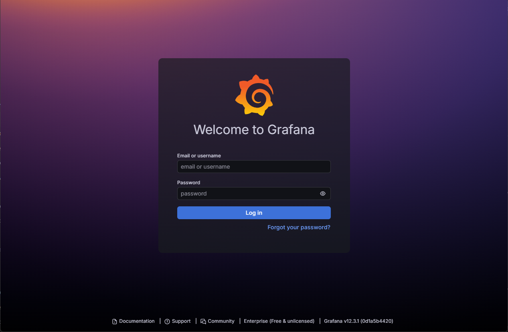
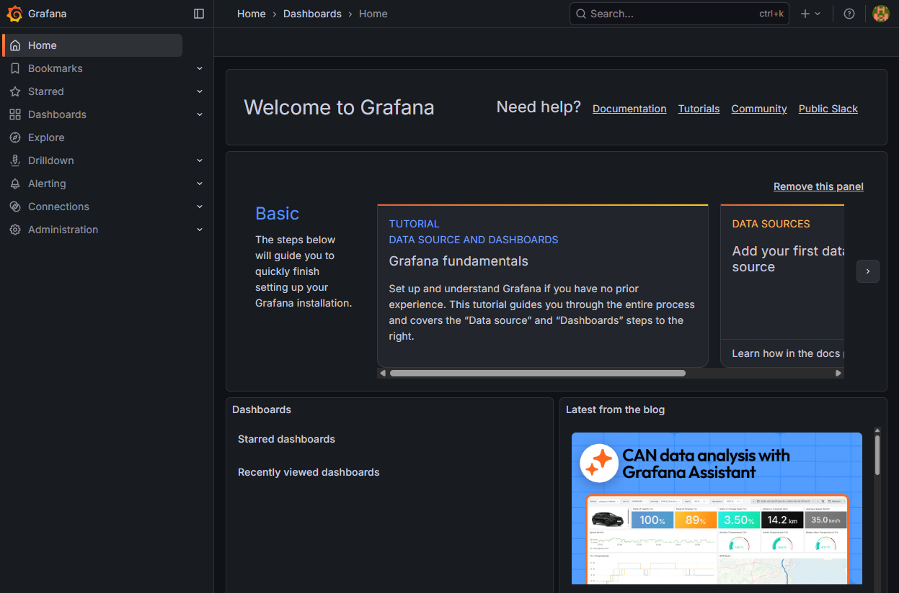

## Module 4 - Grafana Integration and Dashboards

### What are we going to see today?

One of the most amazing things about Prometheus is the huge number of possible integrations. Today is the day we will see how to integrate Prometheus with Grafana and Alertmanager.

Of course, we will come back to these tools many times throughout the training, but today the goal is to understand how they work and how we can integrate them with Prometheus.

&nbsp;
### Grafana

Grafana is an absolutely amazing tool. It’s almost impossible to find someone who doesn’t know it — and even harder to find someone who doesn’t like it.

But what exactly is Grafana?

Let me explain!

Grafana is an open-source project maintained by Grafana Labs, a Swedish company that today offers several products such as Grafana Cloud, Loki, Tempo, and more.

Grafana is a powerful web application that allows us to visualize data in real time through beautiful and highly customizable dashboards, using data from multiple sources — Prometheus being one of the most popular ones.

Basically, Grafana allows you to create very sophisticated queries to retrieve data from TSDBs (Time Series Databases), such as Prometheus, and then turn that data into awesome dashboards and alerts.

Grafana is a tool I personally use a lot and highly recommend. Even if you don’t use Prometheus, Grafana can consume data from many different sources such as MySQL, PostgreSQL, MongoDB, and others.

As mentioned before, Grafana does not rely only on Prometheus as a data source. It supports several different data sources, also known as `datasources`, such as:

- [Prometheus](https://grafana.com/grafana/plugins/grafana-prometheus-datasource)
- [InfluxDB](https://grafana.com/grafana/plugins/grafana-influxdb-datasource)
- [MySQL](https://grafana.com/grafana/plugins/grafana-mysql-datasource)
- [Postgres](https://grafana.com/grafana/plugins/grafana-postgres-datasource)
- [Elasticsearch](https://grafana.com/grafana/plugins/grafana-elasticsearch-datasource)
- [Google Cloud Monitoring](https://grafana.com/grafana/plugins/grafana-google-cloud-monitoring-datasource)
- [Azure Monitor](https://grafana.com/grafana/plugins/grafana-azure-monitor-datasource)
- [AWS CloudWatch](https://grafana.com/grafana/plugins/grafana-aws-cloudwatch-datasource)
- [OpenTSDB](https://grafana.com/grafana/plugins/grafana-opentsdb-datasource)

These data sources are called `datasources`, and Grafana is able to connect to them, retrieve the required data, and use it to build dashboards and visualizations.

The best part is that Grafana treats `datasources` as plugins. This means you can even create your own datasource if Grafana does not support a specific data source you need — or if you want to integrate Grafana with a system you built yourself. Pretty awesome, right?

&nbsp;
#### Installing Grafana

Let’s start our journey by installing Grafana. In this first example, we will install Grafana as a service on Linux, following the same approach we used to install Prometheus.

Later on, we will also see Prometheus and Grafana running as containers in our beloved Kubernetes — don’t worry!

So, let’s get started.

The first thing we need to do is check Grafana’s official documentation. There you will find installation guides for different operating systems, such as:

- [Linux installation](https://grafana.com/docs/grafana/latest/installation/debian/)
- [Windows installation](https://grafana.com/docs/grafana/latest/installation/windows/)
- [macOS installation](https://grafana.com/docs/grafana/latest/installation/mac/)

In this example, we will install Grafana on Linux, following the Debian/Ubuntu documentation.

Fortunately for us, Grafana provides an official repository that makes installation on Linux distributions like Ubuntu very easy.

First, let’s make sure we have some required packages installed:

```bash
sudo apt-get install -y apt-transport-https software-properties-common wget
```

These packages are:
- `apt-transport-https` – allows apt to use HTTPS repositories
- `software-properties-common` – allows apt to manage additional repositories
- `wget` – a tool used to download files from the internet

Before adding the Grafana repository, we need to add its GPG key:

```bash
sudo mkdir -p /etc/apt/keyrings/
wget -q -O - https://apt.grafana.com/gpg.key | gpg --dearmor | sudo tee /etc/apt/keyrings/grafana.gpg > /dev/null
```

Now we can adds the Grafana repository to our system:

```bash
echo "deb [signed-by=/etc/apt/keyrings/grafana.gpg] https://apt.grafana.com stable main" | sudo tee -a /etc/apt/sources.list.d/grafana.list
```

Next, update the package cache and install Grafana:

```bash
sudo apt-get update
sudo apt-get install grafana-enterprise
```

If everything went well, Grafana is now installed. Let’s start the Grafana service and enable it to start automatically on boot:

```bash
sudo systemctl start grafana-server
sudo systemctl enable grafana-server
```

To check if Grafana is running, execute:

```bash
sudo systemctl status grafana-server
```

If the output looks similar to this, Grafana is up and running:

```bash
grafana-server.service - Grafana instance
     Loaded: loaded (/usr/lib/systemd/system/grafana-server.service; enabled; preset: enabled)
     Active: active (running) since Wed 2025-12-17 01:39:31 UTC; 1min 31s ago
       Docs: http://docs.grafana.org
   Main PID: 40039 (grafana)
      Tasks: 21 (limit: 9433)
     Memory: 154.9M (peak: 155.7M)
        CPU: 15.373s
     CGroup: /system.slice/grafana-server.service
```

&nbsp;
Since Grafana is a web application, we can access it using a browser. Open the following URL:

```bash
http://localhost:3000
```



Great! We are now looking at the Grafana login screen. This means we need a user to access the application.

By default, Grafana creates a user with:
- Username: `admin`
- Password: `admin`

Let’s log in using these credentials.

On your first login, Grafana will ask you to change the default password. Feel free to choose any password you want.



Now we are successfully logged in and seeing Grafana’s home screen. For now, there’s not much to see — but we’ll fix that very soon.
