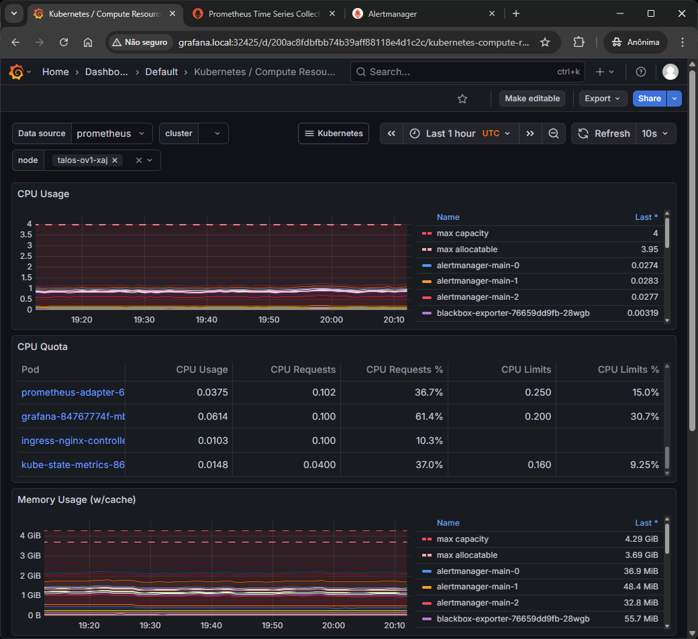
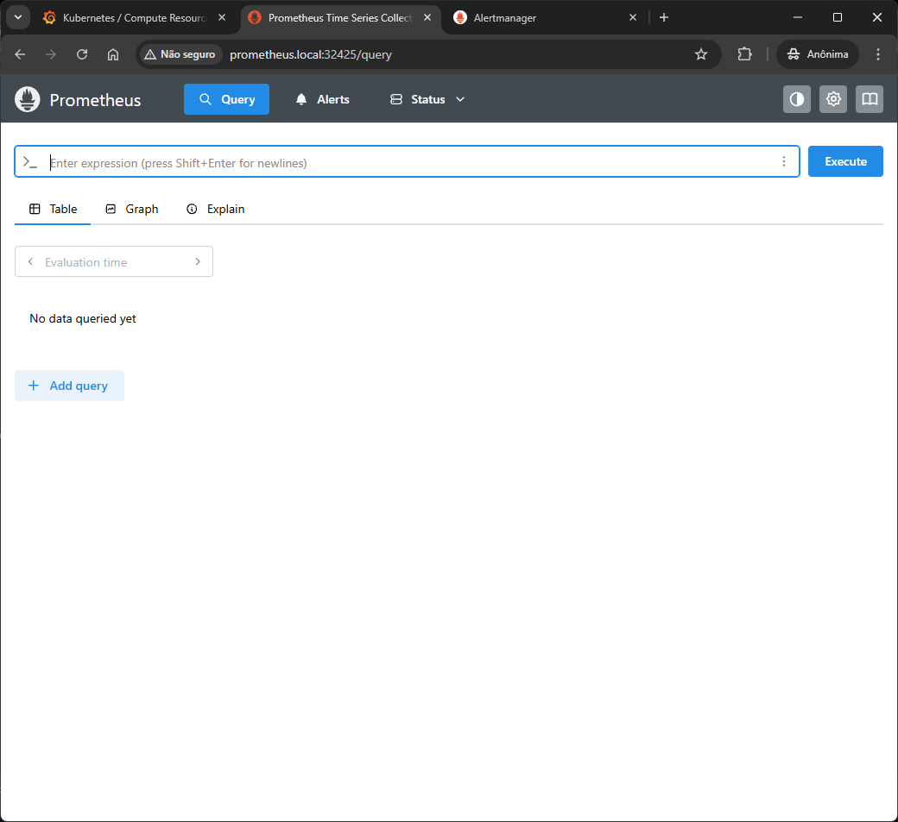
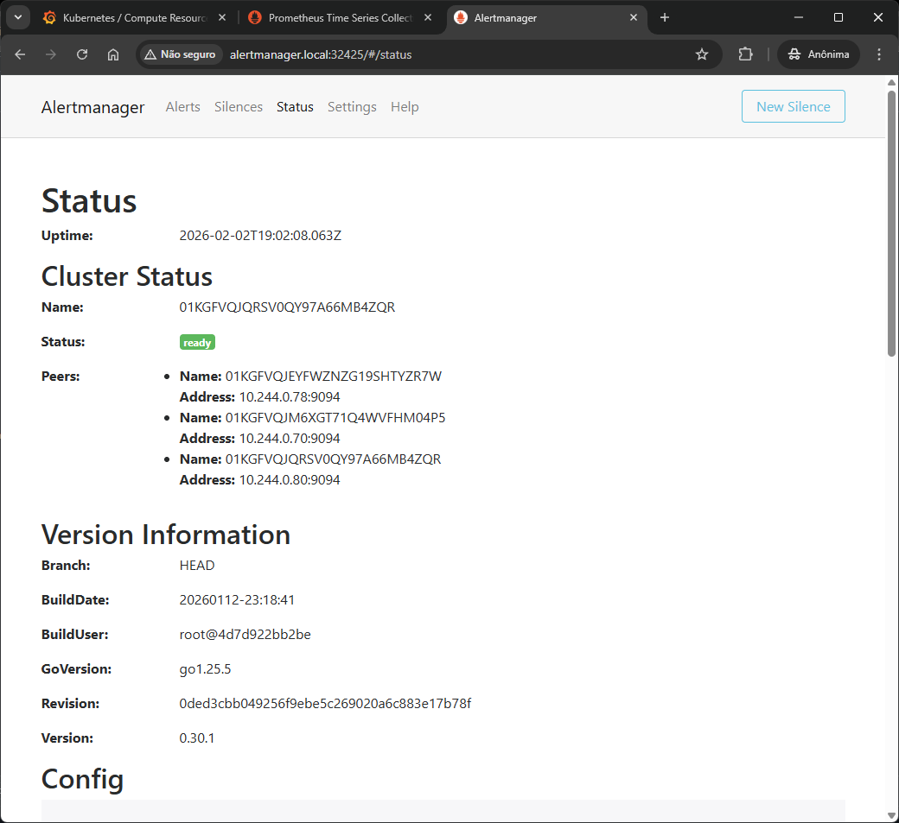

## Module 6: Prometheus in Kubernetes

This repository documents **Module 6 – Prometheus in Kubernetes**, covering the installation and configuration of **kube-prometheus** on a Kubernetes cluster running on **Talos Linux**.

The goal of this module is to understand how Prometheus, Alertmanager, and Grafana work together inside Kubernetes, using Ingress to expose services in a lab environment.

&nbsp;
### Environment Overview

- Kubernetes distribution: Talos Linux
- Observability stack: kube-prometheus
  - Prometheus
  - Alertmanager
  - Grafana
  - node-exporter
  - kube-state-metrics
- Ingress Controller: ingress-nginx
- Access method: Ingress + NodePort
- Local DNS resolution via `/etc/hosts`

&nbsp;
### Installing kube-prometheus

#### Clone the official repository

```bash
git clone https://github.com/prometheus-operator/kube-prometheus.git
cd kube-prometheus
```

&nbsp;
#### Create CRDs and namespace

Before deploying any component, Kubernetes must be aware of the **custom resources** used by the Prometheus Operator.

```bash
kubectl apply -f manifests/setup
```

This step creates:

- CustomResourceDefinitions (Prometheus, ServiceMonitor, Alertmanager, etc)
- The ``monitoring`` namespace

&nbsp;
#### Deploy the monitoring stack

Once CRDs exist, the remaining manifests can be applied.

```bash
kubectl apply -f manifests
```

This step deploys:

- Prometheus instances
- Alertmanager
- Grafana
- Exporters and supporting services

Verify that all pods are running:

```bash
kubectl get pods -n monitoring
```

&nbsp;
#### How Prometheus Discovers Targets

Prometheus does not scrape services automatically.  
Target discovery is controlled by Kubernetes resources such as:

- ``ServiceMonitor``
- ``PodMonitor``

These resources define **what** should be scraped and **how**.

The Prometheus Operator continuously reconciles these objects and updates the Prometheus configuration automatically.

&nbsp;
### Exposing Grafana

#### Why Ingress is Required

Grafana runs inside the cluster and is only accessible through a ClusterIP service by default.

To access it externally without exposing multiple NodePorts, an **Ingress Controller** is used to route HTTP traffic.

&nbsp;
#### Grafana Ingress Configuration

An Ingress resource is created to route requests for ``grafana.local`` to the Grafana service.

```yaml
apiVersion: networking.k8s.io/v1
kind: Ingress
metadata:
  name: grafana
  namespace: monitoring
  annotations:
    nginx.ingress.kubernetes.io/rewrite-target: /
spec:
  ingressClassName: nginx
  rules:
  - host: grafana.local
    http:
      paths:
      - path: /
        pathType: Prefix
        backend:
          service:
            name: grafana
            port:
              number: 3000
```

This configuration means:

- Incoming HTTP requests for ``grafana.local``
- Are handled by the NGINX Ingress Controller
- And forwarded to the Grafana service on port ``3000``

&nbsp;
#### Local DNS Resolution

Since no external DNS exists in this lab, the hostname is resolved locally.

```txt
192.168.0.109 grafana.local
```

This entry maps the hostname to the IP address of the Kubernetes node running the Ingress Controller.

&nbsp;
#### NodePort Exposure

Because the cluster does not have a cloud LoadBalancer, the Ingress Controller service is exposed using ``NodePort``.

Access pattern:

```
http://grafana.local:<NODEPORT>
```

The NodePort can be identified using:

```bash
kubectl get svc -n ingress-nginx
```

&nbsp;
### Grafana Access and Authentication

Grafana is now accessible through the browser.

Default credentials:

``username: admin``
``password: admin``

If needed, the password can be retrieved from Kubernetes secrets:

```bash
kubectl get secret grafana-admin -n monitoring -o jsonpath="{.data.admin-password}" | base64 -d
```
&nbsp;
### Exposing Prometheus and Alertmanager via Ingress

In this step of the training, we extended the kube-prometheus setup by exposing Prometheus and Alertmanager using Kubernetes Ingress.  
The goal is to access these components in a clean and production-like way, without relying on port-forwarding.

This cluster is running on Talos Linux, using ingress-nginx as the Ingress Controller.

&nbsp;
### Why use Ingress instead of port-forward?

Using `kubectl port-forward` is useful for quick tests, but it has limitations:

- Requires an active kubectl session
- Not suitable for long-term access
- Not aligned with production setups

Ingress provides:

- Centralized HTTP access
- Host-based routing
- Better alignment with real-world Kubernetes environments

&nbsp;
### Services created by kube-prometheus

After installing kube-prometheus, the following Services were created in the `monitoring` namespace:

- Grafana → `grafana` (port 3000)
- Prometheus → `prometheus-k8s` (port 9090)
- Alertmanager → `alertmanager-main` (port 9093)

These Services are of type `ClusterIP`, which means they are only accessible inside the cluster and must be exposed using Ingress.

&nbsp;
### Ingress configuration

We created a single Ingress resource to expose Grafana, Prometheus, and Alertmanager using different hostnames.

```yaml
apiVersion: networking.k8s.io/v1
kind: Ingress
metadata:
  name: grafana
  namespace: monitoring
  annotations:
    nginx.ingress.kubernetes.io/rewrite-target: /
spec:
  ingressClassName: nginx
  rules:
    - host: grafana.local
      http:
        paths:
          - path: /
            pathType: Prefix
            backend:
              service:
                name: grafana
                port:
                  number: 3000
    - host: prometheus.local
      http:
        paths:
        - path: /
          pathType: Prefix
          backend:
            service:
              name: prometheus-k8s
              port:
                number: 9090
    - host: alertmanager.local
      http:
        paths:
        - path: /
          pathType: Prefix
          backend:
            service:
              name: alertmanager-main
              port:
                number: 9093
```

&nbsp;
### Local DNS configuration

Since this is a local cluster, the hostnames were mapped manually in the `/etc/hosts` file on the local machine:

```txt
NODE_IP grafana.local
NODE_IP prometheus.local
NODE_IP alertmanager.local
```

The ingress-nginx controller is exposed using a NodePort, so access is done through the NodePort assigned to port 80.

&nbsp;
### Access URLs

With the configuration in place, the components are accessible at:

- Grafana  
  `http://grafana.local:NODEPORT`

- Prometheus  
  `http://prometheus.local:NODEPORT`

- Alertmanager  
  `http://alertmanager.local:NODEPORT`

&nbsp;
### Validation

To validate the setup, the following commands were used:

```bash
kubectl get ingress -n monitoring
kubectl describe ingress monitoring -n monitoring
kubectl get svc -n ingress-nginx
```

Additionally, logs from the ingress controller can be checked if needed:

```bash
kubectl logs -n ingress-nginx deploy/ingress-nginx-controller
```

&nbsp;
### Screenshots

Add screenshots below to document the setup:

- Grafana dashboard  
  

- Prometheus UI  
  

- Alertmanager UI  
  
